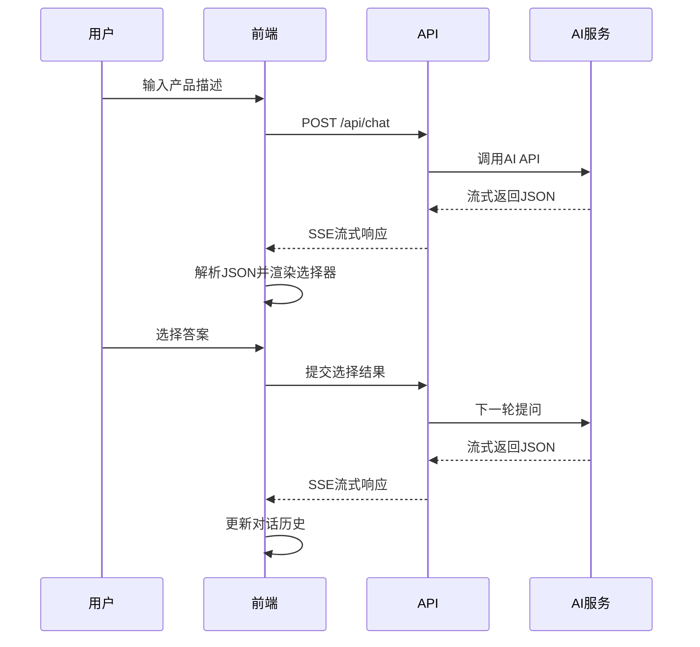
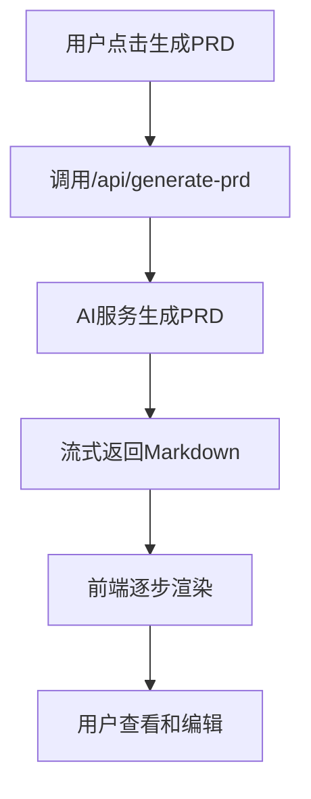
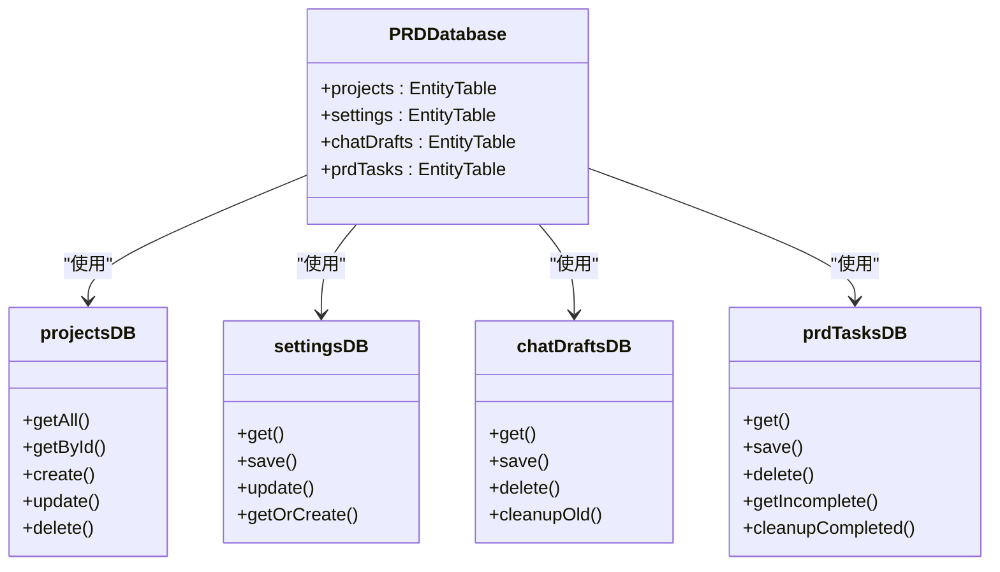

# 核心功能模块

<cite>
**本文档引用的文件**  
- [page.tsx](file://prd-generator\src\app\page.tsx)
- [chat\route.ts](file://prd-generator\src\app\api\chat\route.ts)
- [generate-prd\route.ts](file://prd-generator\src\app\api\generate-prd\route.ts)
- [index.ts](file://prd-generator\src\store\index.ts)
- [db.ts](file://prd-generator\src\lib\db.ts)
- [crypto.ts](file://prd-generator\src\lib\crypto.ts)
- [project-card.tsx](file://prd-generator\src\components\project-card.tsx)
- [new-project-dialog.tsx](file://prd-generator\src\components\new-project-dialog.tsx)
- [smart-selector.tsx](file://prd-generator\src\components\smart-selector.tsx)
- [index.ts](file://prd-generator\src\types\index.ts)
- [validator.ts](file://prd-generator\src\lib\validator.ts)
- [settings\page.tsx](file://prd-generator\src\app\settings\page.tsx)
- [project\[id]\chat\page.tsx](file://prd-generator\src\app\project\[id]\chat\page.tsx)
- [project\[id]\prd\page.tsx](file://prd-generator\src\app\project\[id]\prd\page.tsx)
</cite>

## 目录
1. [多项目管理](#多项目管理)
2. [AI引导式对话系统](#ai引导式对话系统)
3. [PRD文档生成](#prd文档生成)
4. [数据持久化与安全](#数据持久化与安全)
5. [用户工作流](#用户工作流)
6. [API端点处理](#api端点处理)

## 多项目管理

PRDbot支持多项目管理，用户可以在首页创建、查看和删除项目。每个项目都有唯一的ID，用户可以通过点击项目卡片进入项目的聊天或PRD页面。

**项目创建**：用户在首页点击“新建项目”按钮，输入产品描述后，系统会自动提取项目名称并创建项目。项目创建后，用户会被重定向到该项目的聊天页面。

**项目列表展示**：首页展示所有项目的列表，支持按名称或描述搜索。每个项目卡片显示项目名称、状态、进度和最后更新时间。用户可以点击卡片继续编辑或查看PRD。

**项目删除**：用户可以通过项目卡片的下拉菜单删除项目。删除操作会从数据库中移除项目数据，并更新项目列表。

**Section sources**
- [page.tsx](file://prd-generator\src\app\page.tsx#L1-L110)
- [project-card.tsx](file://prd-generator\src\components\project-card.tsx#L1-L128)
- [new-project-dialog.tsx](file://prd-generator\src\components\new-project-dialog.tsx#L1-L107)

## AI引导式对话系统

AI引导式对话系统通过SSE流式接收AI问题和选择器，引导用户逐步完善产品需求。系统使用`/api/chat`端点与AI服务通信，接收流式响应并解析为结构化的JSON数据。

**SSE流式接收**：系统通过`fetch`请求调用`/api/chat`端点，设置`stream: true`以启用流式响应。响应数据以SSE格式传输，客户端通过`ReadableStream`读取并解析。

**AI问题生成**：AI根据系统提示词生成1-3个问题，每个问题包含单选、多选或下拉选项。问题数据结构包括问题ID、类型、选项和是否必填。

**选择器交互**：系统使用`SmartSelector`组件渲染AI生成的选择器。用户选择答案后，系统将选择结果添加到对话历史中，并触发下一轮AI提问。



**Diagram sources**
- [chat\route.ts](file://prd-generator\src\app\api\chat\route.ts#L1-L426)
- [smart-selector.tsx](file://prd-generator\src\components\smart-selector.tsx#L1-L255)
- [project\[id]\chat\page.tsx](file://prd-generator\src\app\project\[id]\chat\page.tsx)

**Section sources**
- [chat\route.ts](file://prd-generator\src\app\api\chat\route.ts#L1-L426)
- [smart-selector.tsx](file://prd-generator\src\components\smart-selector.tsx#L1-L255)
- [project\[id]\chat\page.tsx](file://prd-generator\src\app\project\[id]\chat\page.tsx)

## PRD文档生成

PRD文档生成模块整合对话历史生成结构化文档。系统使用`/api/generate-prd`端点调用AI服务，生成完整的PRD文档。

**文档结构**：PRD文档包含产品概述、功能需求、UI/UX设计、技术架构建议、数据模型、技术实现要点、竞品分析和优化建议等部分。

**生成流程**：当AI判断可以生成PRD时，用户点击“生成PRD”按钮，系统调用`/api/generate-prd`端点。端点将对话历史作为上下文发送给AI服务，AI生成Markdown格式的PRD文档。

**流式渲染**：PRD文档以流式方式返回，前端逐步渲染内容，提供实时反馈。生成完成后，用户可以查看、编辑和导出PRD文档。



**Diagram sources**
- [generate-prd\route.ts](file://prd-generator\src\app\api\generate-prd\route.ts#L1-L254)
- [project\[id]\prd\page.tsx](file://prd-generator\src\app\project\[id]\prd\page.tsx)

**Section sources**
- [generate-prd\route.ts](file://prd-generator\src\app\api\generate-prd\route.ts#L1-L254)
- [project\[id]\prd\page.tsx](file://prd-generator\src\app\project\[id]\prd\page.tsx)

## 数据持久化与安全

PRDbot使用Dexie.js进行本地存储，crypto-js加密API Key，确保数据持久化和安全。

**本地存储**：系统使用Dexie.js创建IndexedDB数据库，存储项目、设置、聊天草稿和PRD任务。数据库包含`projects`、`settings`、`chatDrafts`和`prdTasks`四个表。

**数据加密**：API Key使用crypto-js进行AES加密。加密密钥基于浏览器指纹生成，确保密钥的唯一性和安全性。加密后的API Key存储在`settings`表中。

**数据同步**：系统通过Zustand状态管理库同步内存状态和数据库状态。当用户操作项目或设置时，系统更新内存状态并同步到数据库。



**Diagram sources**
- [db.ts](file://prd-generator\src\lib\db.ts#L1-L210)
- [crypto.ts](file://prd-generator\src\lib\crypto.ts#L1-L107)
- [index.ts](file://prd-generator\src\store\index.ts#L1-L853)

**Section sources**
- [db.ts](file://prd-generator\src\lib\db.ts#L1-L210)
- [crypto.ts](file://prd-generator\src\lib\crypto.ts#L1-L107)
- [index.ts](file://prd-generator\src\store\index.ts#L1-L853)

## 用户工作流

用户从首页创建项目，到在`/project/[id]/chat`页面与AI交互，再到`/project/[id]/prd`页面查看和编辑生成文档的完整工作流如下：

1. **创建项目**：用户在首页点击“新建项目”按钮，输入产品描述后创建项目。
2. **AI对话**：用户进入`/project/[id]/chat`页面，与AI进行多轮对话，逐步完善产品需求。
3. **生成PRD**：当AI判断可以生成PRD时，用户点击“生成PRD”按钮，系统生成PRD文档。
4. **查看和编辑**：用户进入`/project/[id]/prd`页面，查看和编辑生成的PRD文档。
5. **导出文档**：用户可以将PRD文档导出为Markdown、PDF或Word格式。

**Section sources**
- [page.tsx](file://prd-generator\src\app\page.tsx#L1-L110)
- [project\[id]\chat\page.tsx](file://prd-generator\src\app\project\[id]\chat\page.tsx)
- [project\[id]\prd\page.tsx](file://prd-generator\src\app\project\[id]\prd\page.tsx)

## API端点处理

PRDbot的`/api/chat`和`/api/generate-prd`两个API端点处理流式响应，确保高效和安全的通信。

**/api/chat端点**：
- 接收用户消息、模型和API Key。
- 调用AI服务，接收流式响应。
- 校验AI响应的JSON结构，确保符合预期格式。
- 如果校验失败，自动重试最多2次。
- 返回校验后的结构化数据。

**/api/generate-prd端点**：
- 接收对话历史、模型和API Key。
- 调用AI服务，生成PRD文档。
- 返回流式响应，前端逐步渲染内容。
- 支持中断和恢复生成任务。

```mermaid
sequenceDiagram
participant 前端
participant /api/chat
participant AI服务
前端->>/api/chat : POST请求
/api/chat->>AI服务 : 调用API
AI服务-->>/api/chat : 流式返回
/api/chat-->>前端 : SSE流式响应
前端->>前端 : 解析并渲染
```

```mermaid
sequenceDiagram
participant 前端
participant /api/generate-prd
participant AI服务
前端->>/api/generate-prd : POST请求
/api/generate-prd->>AI服务 : 调用API
AI服务-->>/api/generate-prd : 流式返回
/api/generate-prd-->>前端 : SSE流式响应
前端->>前端 : 逐步渲染PRD
```

**Diagram sources**
- [chat\route.ts](file://prd-generator\src\app\api\chat\route.ts#L1-L426)
- [generate-prd\route.ts](file://prd-generator\src\app\api\generate-prd\route.ts#L1-L254)

**Section sources**
- [chat\route.ts](file://prd-generator\src\app\api\chat\route.ts#L1-L426)
- [generate-prd\route.ts](file://prd-generator\src\app\api\generate-prd\route.ts#L1-L254)