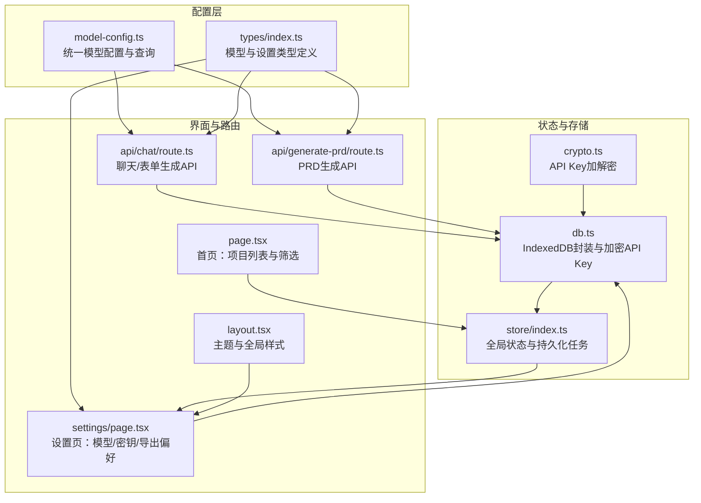
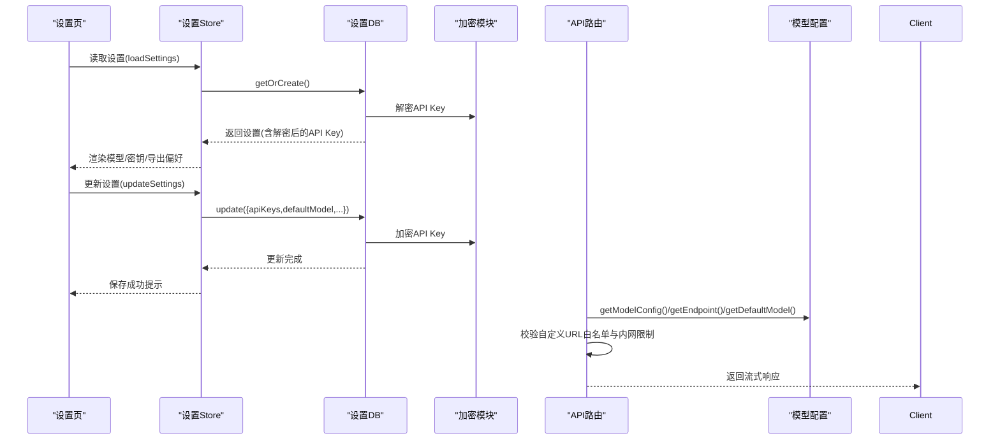
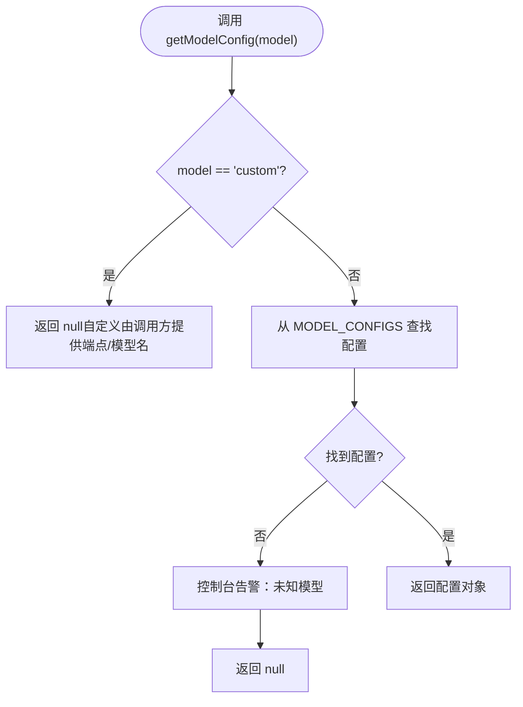
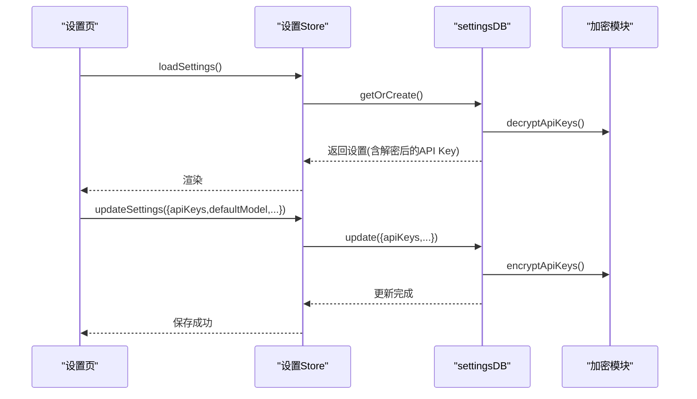
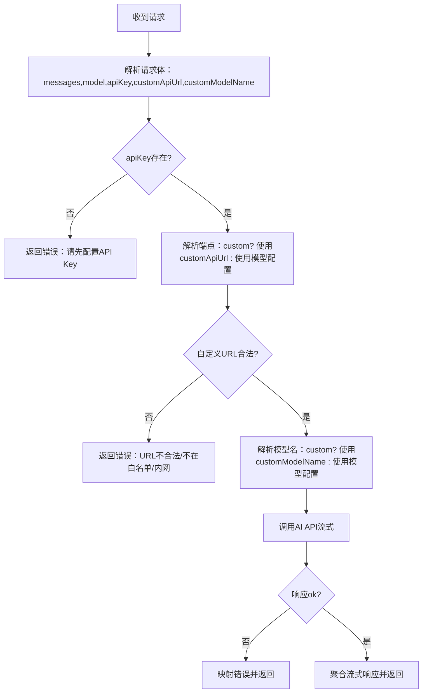
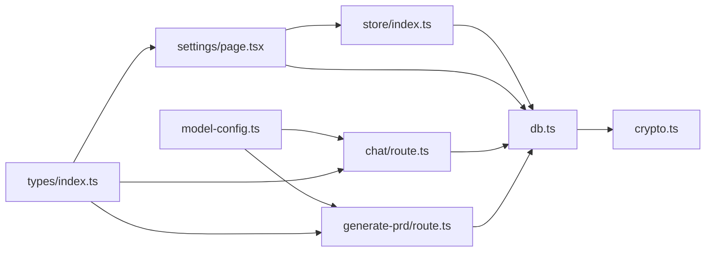

# 模型配置中心

<cite>
**本文引用的文件**
- [model-config.ts](file://prd-generator/src/lib/model-config.ts)
- [types/index.ts](file://prd-generator/src/types/index.ts)
- [store/index.ts](file://prd-generator/src/store/index.ts)
- [db.ts](file://prd-generator/src/lib/db.ts)
- [crypto.ts](file://prd-generator/src/lib/crypto.ts)
- [settings/page.tsx](file://prd-generator/src/app/settings/page.tsx)
- [layout.tsx](file://prd-generator/src/app/layout.tsx)
- [page.tsx](file://prd-generator/src/app/page.tsx)
- [chat/route.ts](file://prd-generator/src/app/api/chat/route.ts)
- [generate-prd/route.ts](file://prd-generator/src/app/api/generate-prd/route.ts)
- [package.json](file://prd-generator/package.json)
</cite>

## 目录
1. [简介](#简介)
2. [项目结构](#项目结构)
3. [核心组件](#核心组件)
4. [架构总览](#架构总览)
5. [详细组件分析](#详细组件分析)
6. [依赖分析](#依赖分析)
7. [性能考虑](#性能考虑)
8. [故障排查指南](#故障排查指南)
9. [结论](#结论)
10. [附录](#附录)

## 简介
本文件聚焦“模型配置中心”的设计与实现，系统性梳理了统一的AI模型配置、默认模型与端点解析、自定义模型支持、以及在设置页与API路由中的应用方式。通过集中式配置与类型约束，确保多模型接入的一致性、可扩展性与安全性，同时兼顾本地存储与密钥加密的安全策略。

## 项目结构
模型配置中心位于 lib 层，配合 store、types、API 路由与设置页面共同构成完整的配置闭环。

图表来源
- [model-config.ts](file://prd-generator/src/lib/model-config.ts#L1-L106)
- [types/index.ts](file://prd-generator/src/types/index.ts#L1-L120)
- [store/index.ts](file://prd-generator/src/store/index.ts#L1-L211)
- [db.ts](file://prd-generator/src/lib/db.ts#L1-L177)
- [crypto.ts](file://prd-generator/src/lib/crypto.ts#L1-L120)
- [settings/page.tsx](file://prd-generator/src/app/settings/page.tsx#L1-L120)
- [layout.tsx](file://prd-generator/src/app/layout.tsx#L1-L45)
- [page.tsx](file://prd-generator/src/app/page.tsx#L1-L144)
- [chat/route.ts](file://prd-generator/src/app/api/chat/route.ts#L1-L120)
- [generate-prd/route.ts](file://prd-generator/src/app/api/generate-prd/route.ts#L1-L120)

章节来源
- [model-config.ts](file://prd-generator/src/lib/model-config.ts#L1-L106)
- [types/index.ts](file://prd-generator/src/types/index.ts#L1-L120)
- [store/index.ts](file://prd-generator/src/store/index.ts#L1-L211)
- [db.ts](file://prd-generator/src/lib/db.ts#L1-L177)
- [crypto.ts](file://prd-generator/src/lib/crypto.ts#L1-L120)
- [settings/page.tsx](file://prd-generator/src/app/settings/page.tsx#L1-L120)
- [layout.tsx](file://prd-generator/src/app/layout.tsx#L1-L45)
- [page.tsx](file://prd-generator/src/app/page.tsx#L1-L144)
- [chat/route.ts](file://prd-generator/src/app/api/chat/route.ts#L1-L120)
- [generate-prd/route.ts](file://prd-generator/src/app/api/generate-prd/route.ts#L1-L120)

## 核心组件
- 模型配置模块：集中定义各模型端点、默认模型名、上下文窗口、计费单价与特性支持，并提供查询与校验能力。
- 类型系统：统一模型枚举、设置结构、请求/响应类型，保证跨模块一致性。
- 设置与存储：设置页提供模型/密钥/导出偏好配置；数据库封装与加密保障密钥安全。
- API路由：聊天与PRD生成API在请求阶段解析模型配置，支持自定义端点与模型名。

章节来源
- [model-config.ts](file://prd-generator/src/lib/model-config.ts#L1-L106)
- [types/index.ts](file://prd-generator/src/types/index.ts#L100-L120)
- [settings/page.tsx](file://prd-generator/src/app/settings/page.tsx#L1-L120)
- [db.ts](file://prd-generator/src/lib/db.ts#L129-L177)
- [chat/route.ts](file://prd-generator/src/app/api/chat/route.ts#L184-L277)
- [generate-prd/route.ts](file://prd-generator/src/app/api/generate-prd/route.ts#L107-L164)

## 架构总览
模型配置中心贯穿“配置—类型—状态—路由—界面”的全链路，形成如下闭环：
- 配置层：统一模型配置与查询函数，支持内置模型与自定义模型。
- 类型层：定义模型枚举与设置结构，确保调用侧类型安全。
- 状态层：设置页加载/更新设置，存储层持久化并加密API Key。
- 路由层：API在运行时解析端点与模型名，校验自定义URL白名单与内网限制。
- 界面层：设置页展示模型选择、密钥输入、导出偏好与主题切换。

图表来源
- [settings/page.tsx](file://prd-generator/src/app/settings/page.tsx#L27-L120)
- [store/index.ts](file://prd-generator/src/store/index.ts#L224-L260)
- [db.ts](file://prd-generator/src/lib/db.ts#L129-L177)
- [crypto.ts](file://prd-generator/src/lib/crypto.ts#L214-L246)
- [chat/route.ts](file://prd-generator/src/app/api/chat/route.ts#L184-L277)
- [generate-prd/route.ts](file://prd-generator/src/app/api/generate-prd/route.ts#L107-L164)
- [model-config.ts](file://prd-generator/src/lib/model-config.ts#L51-L106)

## 详细组件分析

### 组件A：模型配置模块（model-config.ts）
- 职责
  - 统一管理内置模型端点、默认模型名、上下文窗口、计费单价与特性支持。
  - 提供查询函数：获取完整配置、端点URL、默认模型名、支持模型列表与支持性校验。
  - 支持自定义模型：当模型标识为“custom”时返回空配置，由调用方提供端点与模型名。
- 关键点
  - 环境变量覆盖：内置模型默认模型名可通过NEXT_PUBLIC_*环境变量覆盖。
  - 查询健壮性：未知模型会发出告警并返回空，避免崩溃。
- 性能与复杂度
  - 查询为常量时间，无额外空间开销。
- 安全与扩展
  - 与API路由配合，确保端点与模型名解析一致；新增模型只需扩展MODEL_CONFIGS与类型定义。

图表来源
- [model-config.ts](file://prd-generator/src/lib/model-config.ts#L51-L106)

章节来源
- [model-config.ts](file://prd-generator/src/lib/model-config.ts#L1-L106)

### 组件B：类型系统（types/index.ts）
- 职责
  - 定义AI模型枚举（含内置与自定义）与设置结构（含默认模型、自定义端点与模型名、导出偏好）。
  - 定义聊天/PRD生成相关的请求/响应与任务状态类型，确保跨模块一致性。
- 关键点
  - AI_MODELS：统一暴露内置模型清单，便于设置页与路由侧使用。
  - Settings：defaultModel、customApiUrl、customModelName、exportPreferences等字段。
- 复杂度
  - 类型定义，无运行时开销。

章节来源
- [types/index.ts](file://prd-generator/src/types/index.ts#L100-L120)
- [types/index.ts](file://prd-generator/src/types/index.ts#L120-L175)
- [types/index.ts](file://prd-generator/src/types/index.ts#L212-L242)

### 组件C：设置与存储（settings/page.tsx + store/index.ts + db.ts + crypto.ts）
- 设置页（settings/page.tsx）
  - 加载/保存设置：读取全局设置，渲染模型选择、API Key输入、自定义端点与模型名、导出偏好与主题切换。
  - 保存策略：一次性原子更新，避免多次DB写入。
- 设置Store（store/index.ts）
  - 提供loadSettings/updateSettings/setApiKey/getApiKey等方法，封装设置的读取与更新。
- 数据库与加密（db.ts + crypto.ts）
  - settingsDB：提供get、getOrCreate、save、update等方法；读取时解密API Key，更新/保存时加密API Key。
  - crypto.ts：PBKDF2派生密钥、AES-CBC加密、HMAC完整性校验；支持新旧版本兼容。
- 流程图

图表来源
- [settings/page.tsx](file://prd-generator/src/app/settings/page.tsx#L27-L120)
- [store/index.ts](file://prd-generator/src/store/index.ts#L224-L260)
- [db.ts](file://prd-generator/src/lib/db.ts#L129-L177)
- [crypto.ts](file://prd-generator/src/lib/crypto.ts#L214-L246)

章节来源
- [settings/page.tsx](file://prd-generator/src/app/settings/page.tsx#L1-L200)
- [store/index.ts](file://prd-generator/src/store/index.ts#L224-L260)
- [db.ts](file://prd-generator/src/lib/db.ts#L129-L177)
- [crypto.ts](file://prd-generator/src/lib/crypto.ts#L1-L120)

### 组件D：API路由中的模型解析（chat/route.ts + generate-prd/route.ts）
- 职责
  - 在请求阶段解析模型配置，确定端点与实际模型名；支持自定义端点与模型名。
  - 校验自定义URL白名单与内网限制，防止SSRF。
- 关键流程
  - 端点解析：若model为custom，则使用customApiUrl；否则从模型配置获取endpoint。
  - 模型名解析：若model为custom，则使用customModelName；否则从模型配置获取defaultModel。
  - 安全校验：validateCustomApiUrl校验HTTPS、内网地址与域名白名单。
- 错误处理
  - 缺少API Key、无效模型配置、自定义URL非法、响应异常等均返回明确错误码与信息。

图表来源
- [chat/route.ts](file://prd-generator/src/app/api/chat/route.ts#L184-L277)
- [generate-prd/route.ts](file://prd-generator/src/app/api/generate-prd/route.ts#L107-L164)
- [model-config.ts](file://prd-generator/src/lib/model-config.ts#L51-L106)

章节来源
- [chat/route.ts](file://prd-generator/src/app/api/chat/route.ts#L1-L200)
- [generate-prd/route.ts](file://prd-generator/src/app/api/generate-prd/route.ts#L1-L200)
- [model-config.ts](file://prd-generator/src/lib/model-config.ts#L51-L106)

### 组件E：首页与项目状态（page.tsx + store/index.ts）
- 首页（page.tsx）
  - 展示项目列表、搜索与标签筛选；提供新建项目与设置入口。
- 项目Store（store/index.ts）
  - 提供项目生命周期管理：创建、加载、更新、删除、消息追加、PRD内容更新、状态变更等。
  - 项目元数据包含selectedModel，用于记录该项目使用的模型标识。

章节来源
- [page.tsx](file://prd-generator/src/app/page.tsx#L1-L144)
- [store/index.ts](file://prd-generator/src/store/index.ts#L1-L211)

## 依赖分析
- 模块耦合
  - model-config.ts 与 API 路由强耦合：路由依赖其查询函数解析端点与模型名。
  - settings/page.tsx 与 store/index.ts 强耦合：设置页直接使用设置Store。
  - db.ts 与 crypto.ts：设置DB在读取/保存时依赖加密模块。
- 外部依赖
  - Next.js（路由、SSR、字体）、Radix UI（组件库）、Zustand（状态管理）、Dexie（IndexedDB）等。

图表来源
- [model-config.ts](file://prd-generator/src/lib/model-config.ts#L1-L106)
- [types/index.ts](file://prd-generator/src/types/index.ts#L100-L120)
- [store/index.ts](file://prd-generator/src/store/index.ts#L224-L260)
- [db.ts](file://prd-generator/src/lib/db.ts#L129-L177)
- [crypto.ts](file://prd-generator/src/lib/crypto.ts#L214-L246)
- [settings/page.tsx](file://prd-generator/src/app/settings/page.tsx#L27-L120)
- [chat/route.ts](file://prd-generator/src/app/api/chat/route.ts#L184-L277)
- [generate-prd/route.ts](file://prd-generator/src/app/api/generate-prd/route.ts#L107-L164)

章节来源
- [package.json](file://prd-generator/package.json#L22-L64)

## 性能考虑
- 模型查询为O(1)，无额外空间开销，适合高频调用。
- 设置页保存采用一次原子更新，减少DB写入次数。
- PRD生成任务使用数组分片累积流式内容，降低字符串拼接开销。
- IndexedDB批量清理与版本迁移策略，避免数据膨胀。

## 故障排查指南
- “无效的模型配置”
  - 检查model参数是否为内置模型或custom；若为custom，确认customApiUrl与customModelName均已配置。
  - 参考：[chat/route.ts](file://prd-generator/src/app/api/chat/route.ts#L215-L251)、[generate-prd/route.ts](file://prd-generator/src/app/api/generate-prd/route.ts#L128-L164)
- “请先配置 API Key”
  - 确认设置页已保存对应模型的API Key；或在custom模式下提供customApiUrl与customModelName。
  - 参考：[settings/page.tsx](file://prd-generator/src/app/settings/page.tsx#L120-L200)、[db.ts](file://prd-generator/src/lib/db.ts#L129-L177)
- “自定义 API URL 不合法/不在白名单/内网”
  - 确认URL为HTTPS，且域名在白名单中；避免内网地址。
  - 参考：[chat/route.ts](file://prd-generator/src/app/api/chat/route.ts#L25-L76)、[generate-prd/route.ts](file://prd-generator/src/app/api/generate-prd/route.ts#L24-L75)
- “保存失败/密钥未生效”
  - 检查设置页保存按钮状态与提示；确认DB更新流程未抛错。
  - 参考：[settings/page.tsx](file://prd-generator/src/app/settings/page.tsx#L52-L70)、[db.ts](file://prd-generator/src/lib/db.ts#L129-L177)

章节来源
- [chat/route.ts](file://prd-generator/src/app/api/chat/route.ts#L184-L277)
- [generate-prd/route.ts](file://prd-generator/src/app/api/generate-prd/route.ts#L107-L164)
- [settings/page.tsx](file://prd-generator/src/app/settings/page.tsx#L120-L200)
- [db.ts](file://prd-generator/src/lib/db.ts#L129-L177)

## 结论
模型配置中心通过“统一配置+类型约束+安全校验+加密存储”的设计，实现了多模型接入的一致性与可扩展性。设置页与API路由围绕同一份配置与类型体系工作，既保证了用户体验，又确保了系统的安全性与稳定性。未来可在以下方面持续优化：
- 增加模型特性开关（如JSON模式、流式）的动态启用/禁用。
- 引入模型健康度监控与降级策略。
- 提供模型切换的审计日志与回滚机制。

## 附录
- 相关文件路径与职责概览
  - [model-config.ts](file://prd-generator/src/lib/model-config.ts)：统一模型配置与查询
  - [types/index.ts](file://prd-generator/src/types/index.ts)：模型与设置类型定义
  - [store/index.ts](file://prd-generator/src/store/index.ts)：设置与任务状态管理
  - [db.ts](file://prd-generator/src/lib/db.ts)：IndexedDB封装与API Key加密
  - [crypto.ts](file://prd-generator/src/lib/crypto.ts)：API Key加解密
  - [settings/page.tsx](file://prd-generator/src/app/settings/page.tsx)：设置页UI与交互
  - [chat/route.ts](file://prd-generator/src/app/api/chat/route.ts)：聊天/表单生成API
  - [generate-prd/route.ts](file://prd-generator/src/app/api/generate-prd/route.ts)：PRD生成API