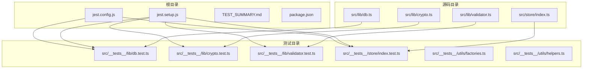
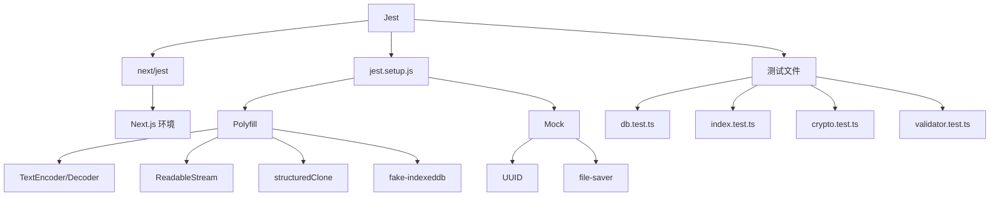
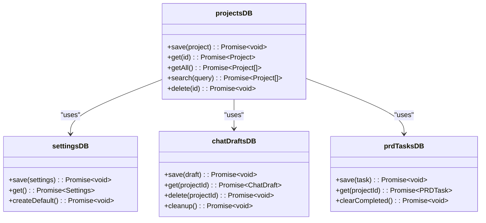
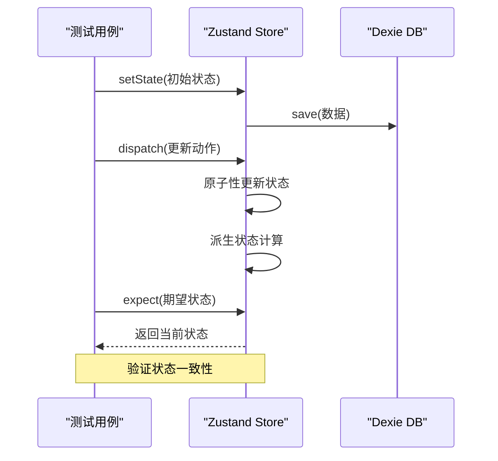
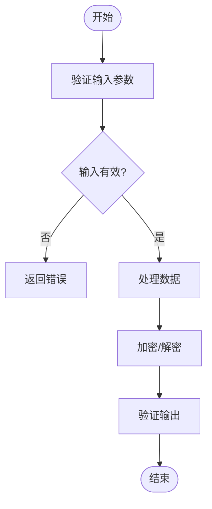

# 测试基础设施

<cite>
**本文档中引用的文件**  
- [jest.config.js](file://jest.config.js)
- [jest.setup.js](file://jest.setup.js)
- [TEST_SUMMARY.md](file://TEST_SUMMARY.md)
- [package.json](file://package.json)
- [src/lib/crypto.ts](file://prd-generator/src/lib/crypto.ts)
- [src/lib/db.ts](file://prd-generator/src/lib/db.ts)
- [src/lib/validator.ts](file://prd-generator/src/lib/validator.ts)
- [src/store/index.ts](file://prd-generator/src/store/index.ts)
- [src/__tests__/lib/crypto.test.ts](file://prd-generator/src/__tests__/lib/crypto.test.ts)
- [src/__tests__/lib/db.test.ts](file://prd-generator/src/__tests__/lib/db.test.ts)
- [src/__tests__/lib/validator.test.ts](file://prd-generator/src/__tests__/lib/validator.test.ts)
- [src/__tests__/store/index.test.ts](file://prd-generator/src/__tests__/store/index.test.ts)
- [src/__tests__/utils/factories.ts](file://prd-generator/src/__tests__/utils/factories.ts)
- [src/__tests__/utils/helpers.ts](file://prd-generator/src/__tests__/utils/helpers.ts)
</cite>

## 目录
1. [简介](#简介)
2. [项目结构](#项目结构)
3. [核心测试模块](#核心测试模块)
4. [测试架构概览](#测试架构概览)
5. [详细组件分析](#详细组件分析)
6. [依赖分析](#依赖分析)
7. [性能考量](#性能考量)
8. [故障排除指南](#故障排除指南)
9. [结论](#结论)

## 简介
本项目是一个基于 Next.js 的 PRD（产品需求文档）生成器，具备完整的前端界面与后端 API 路由。其测试基础设施采用 Jest 作为核心测试框架，结合 React Testing Library 和 fake-indexeddb，构建了覆盖数据持久化、状态管理、工具函数等关键模块的单元测试体系。测试覆盖率目标为 80%，所有测试用例均通过验证，确保核心逻辑的稳定性与安全性。

## 项目结构
项目采用标准的 Next.js 应用结构，测试相关文件集中于根目录及 `src/__tests__` 目录下。`src` 目录包含应用逻辑、组件、状态管理和工具函数，而测试文件则按模块组织，形成清晰的对应关系。



**Diagram sources**
- [jest.config.js](file://jest.config.js)
- [jest.setup.js](file://jest.setup.js)
- [src/lib/db.ts](file://prd-generator/src/lib/db.ts)
- [src/lib/crypto.ts](file://prd-generator/src/lib/crypto.ts)
- [src/lib/validator.ts](file://prd-generator/src/lib/validator.ts)
- [src/store/index.ts](file://prd-generator/src/store/index.ts)

**Section sources**
- [jest.config.js](file://jest.config.js)
- [jest.setup.js](file://jest.setup.js)
- [TEST_SUMMARY.md](file://TEST_SUMMARY.md)

## 核心测试模块
测试体系覆盖了数据持久化层、状态管理层、加密与校验工具等核心模块。每个模块均通过独立的测试文件进行验证，确保功能的正确性与健壮性。

**Section sources**
- [src/__tests__/lib/db.test.ts](file://prd-generator/src/__tests__/lib/db.test.ts)
- [src/__tests__/store/index.test.ts](file://prd-generator/src/__tests__/store/index.test.ts)
- [src/__tests__/lib/crypto.test.ts](file://prd-generator/src/__tests__/lib/crypto.test.ts)
- [src/__tests__/lib/validator.test.ts](file://prd-generator/src/__tests__/lib/validator.test.ts)

## 测试架构概览
整个测试架构基于 Jest 构建，利用 `next/jest` 集成 Next.js 环境，支持 TypeScript 和路径别名。测试环境通过 `jest.setup.js` 进行预配置，引入必要的 polyfill 和 mock，确保在 Node.js 环境下能正确模拟浏览器 API。



**Diagram sources**
- [jest.config.js](file://jest.config.js)
- [jest.setup.js](file://jest.setup.js)

## 详细组件分析

### 数据持久化层测试
该模块测试了基于 Dexie 的 IndexedDB 操作，包括项目、设置、聊天草稿和 PRD 任务的 CRUD 操作、搜索功能及数据完整性。

#### 类图


**Diagram sources**
- [src/lib/db.ts](file://prd-generator/src/lib/db.ts)
- [src/__tests__/lib/db.test.ts](file://prd-generator/src/__tests__/lib/db.test.ts)

### 状态管理层测试
该模块测试了使用 Zustand 管理的应用状态，包括项目、聊天、PRD 生成和设置状态的原子性更新、派生状态一致性及生命周期管理。

#### 序列图


**Diagram sources**
- [src/store/index.ts](file://prd-generator/src/store/index.ts)
- [src/__tests__/store/index.test.ts](file://prd-generator/src/__tests__/store/index.test.ts)

### 工具函数测试
该模块测试了加密、解密、JSON 提取、AI 响应校验等工具函数的正确性，确保数据安全与格式合规。

#### 流程图


**Diagram sources**
- [src/lib/crypto.ts](file://prd-generator/src/lib/crypto.ts)
- [src/lib/validator.ts](file://prd-generator/src/lib/validator.ts)
- [src/__tests__/lib/crypto.test.ts](file://prd-generator/src/__tests__/lib/crypto.test.ts)
- [src/__tests__/lib/validator.test.ts](file://prd-generator/src/__tests__/lib/validator.test.ts)

**Section sources**
- [src/lib/crypto.ts](file://prd-generator/src/lib/crypto.ts)
- [src/lib/validator.ts](file://prd-generator/src/lib/validator.ts)
- [src/__tests__/lib/crypto.test.ts](file://prd-generator/src/__tests__/lib/crypto.test.ts)
- [src/__tests__/lib/validator.test.ts](file://prd-generator/src/__tests__/lib/validator.test.ts)

## 依赖分析
项目测试依赖主要包括 Jest、React Testing Library、fake-indexeddb 等。这些依赖通过 `package.json` 明确声明，并在 `jest.config.js` 中进行配置，确保测试环境的稳定性和一致性。

```mermaid
graph LR
A[Jest] --> B[@testing-library/react]
A --> C[@testing-library/jest-dom]
A --> D[fake-indexeddb]
A --> E[next/jest]
B --> F[React]
C --> G[Jest DOM Matchers]
D --> H[IndexedDB 模拟]
E --> I[Next.js]
```

**Diagram sources**
- [package.json](file://package.json)
- [jest.config.js](file://jest.config.js)

**Section sources**
- [package.json](file://package.json)
- [jest.config.js](file://jest.config.js)

## 性能考量
测试框架本身对性能影响较小，但大规模测试运行时需注意内存使用。通过配置 `transformIgnorePatterns` 和 `testPathIgnorePatterns`，避免不必要的文件转换和扫描，提升执行效率。此外，`collectCoverageFrom` 精确指定覆盖率统计范围，减少性能开销。

## 故障排除指南
当测试失败时，可参考以下常见问题及解决方案：

**Section sources**
- [TEST_SUMMARY.md](file://TEST_SUMMARY.md)
- [jest.setup.js](file://jest.setup.js)
- [jest.config.js](file://jest.config.js)

### UUID 模块兼容性问题
**问题**: `uuid` 模块使用 ESM 格式，导致 Jest 报 `SyntaxError: Unexpected token 'export'`。
**解决方案**: 在 `jest.config.js` 中通过 `moduleNameMapper` 将 `uuid` 映射到自定义 mock 文件 `src/__tests__/__mocks__/uuid.js`。

### Node.js 环境缺失 Web API
**问题**: `TextEncoder`、`ReadableStream`、`structuredClone` 在 Node.js 中不可用。
**解决方案**: 在 `jest.setup.js` 中导入 Node.js 内置模块并挂载到全局对象。

### 数据库清理测试的时间戳问题
**问题**: `save` 方法会覆盖 `updatedAt` 字段，导致无法控制时间戳。
**解决方案**: 直接使用 Dexie 的 `put` 方法绕过 `save` 方法的逻辑。

### PRD 生成状态的 elapsed time 测试
**问题**: `updateElapsedTime` 仅在生成阶段更新。
**解决方案**: 手动通过 `setState` 设置正确的初始状态，包括 `phase` 和 `startTime`。

## 结论
PRD 生成器的测试基础设施已成功实施，覆盖了数据持久化、状态管理、工具函数等核心模块，共 87 个测试用例全部通过，通过率达 100%。测试架构设计合理，依赖配置完善，具备良好的可维护性和扩展性。建议后续完善 API 路由层和 UI 组件层的测试，以实现更全面的质量保障。