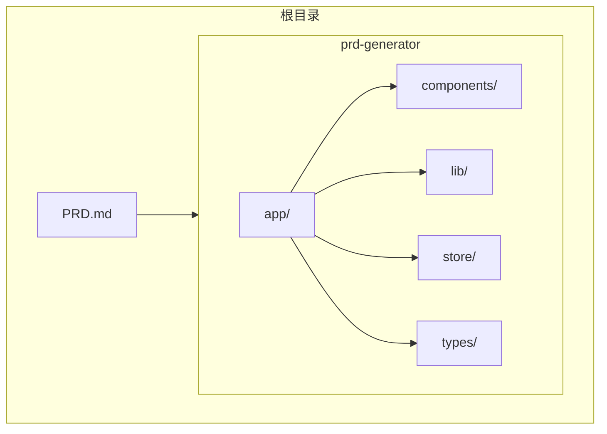
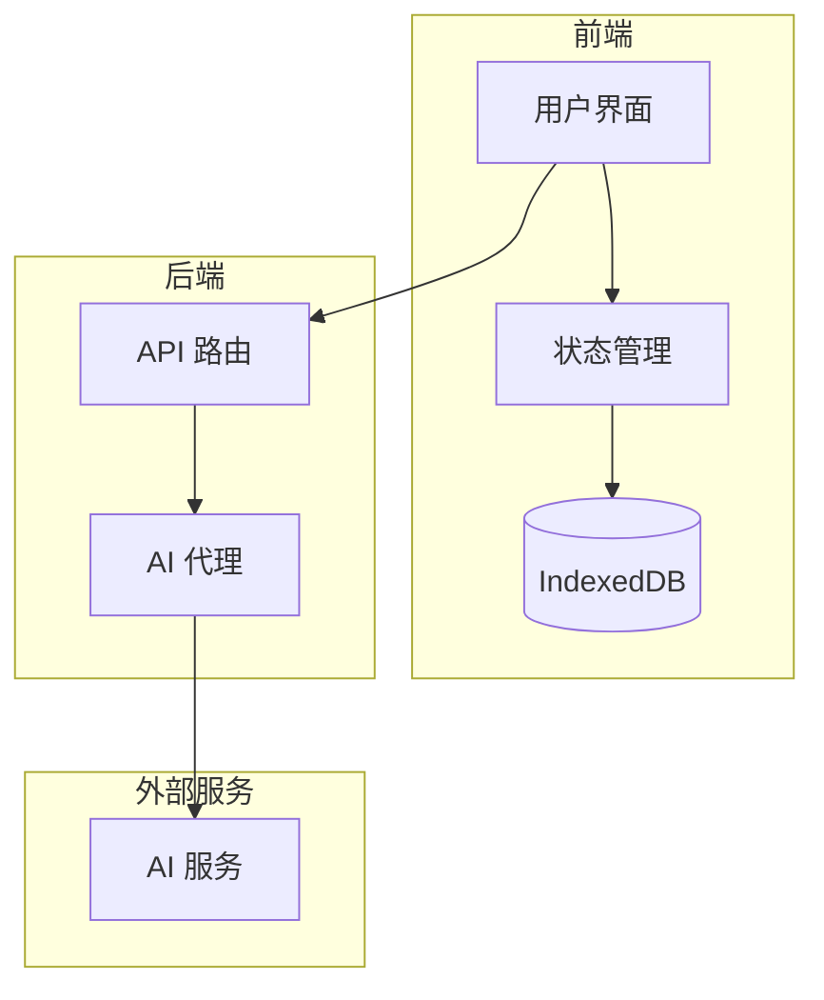
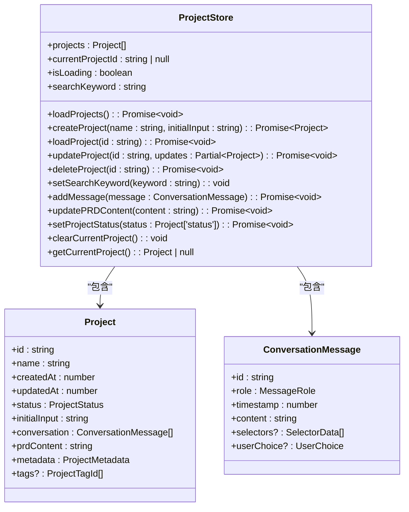
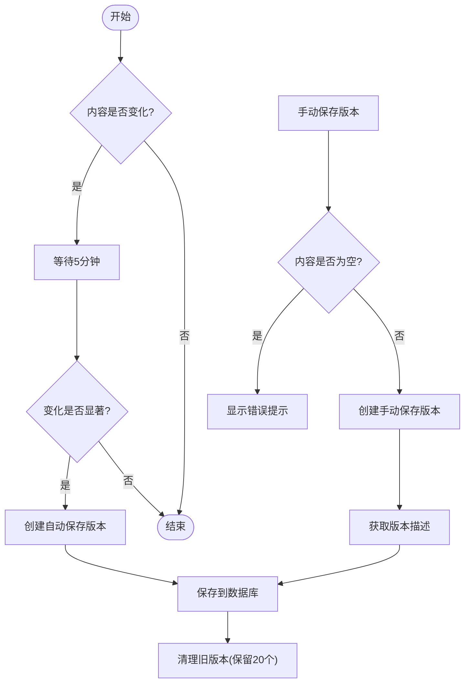
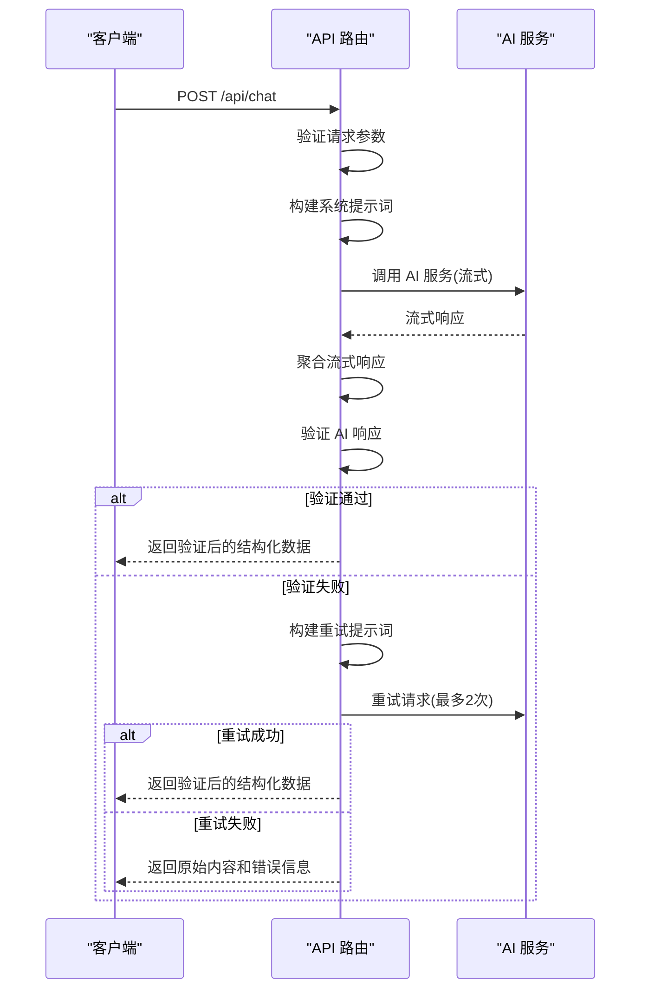
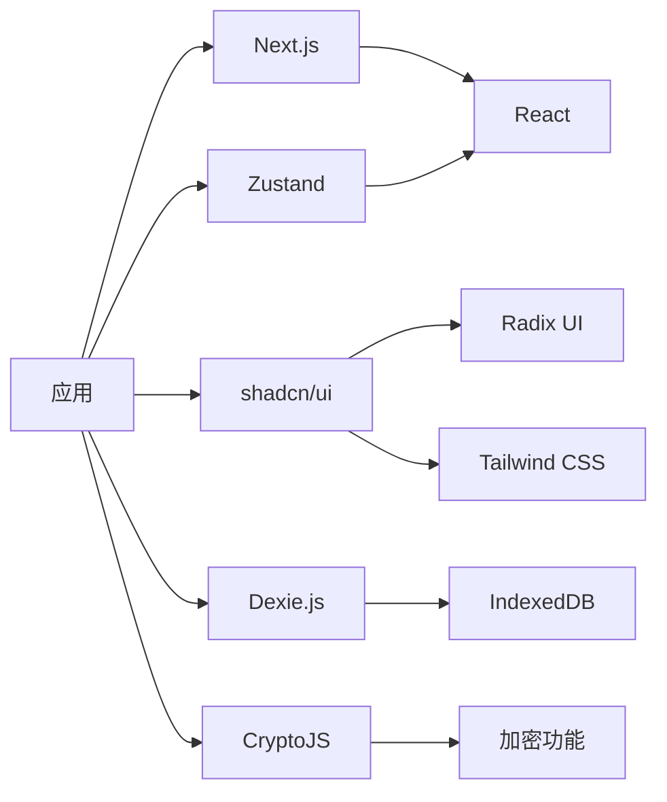

# 版本控制

<cite>
**本文档引用的文件**   
- [PRD.md](file://PRD.md)
- [package.json](file://prd-generator/package.json)
- [next.config.ts](file://prd-generator/next.config.ts)
- [tsconfig.json](file://prd-generator/tsconfig.json)
- [README.md](file://prd-generator/README.md)
- [layout.tsx](file://prd-generator/src/app/layout.tsx)
- [page.tsx](file://prd-generator/src/app/page.tsx)
- [db.ts](file://prd-generator/src/lib/db.ts)
- [utils.ts](file://prd-generator/src/lib/utils.ts)
- [index.ts](file://prd-generator/src/store/index.ts)
- [index.ts](file://prd-generator/src/types/index.ts)
- [crypto.ts](file://prd-generator/src/lib/crypto.ts)
- [version-history.tsx](file://prd-generator/src/components/version-history.tsx)
- [route.ts](file://prd-generator/src/app/api/analyze/route.ts)
- [route.ts](file://prd-generator/src/app/api/chat/route.ts)
</cite>

## 目录
1. [简介](#简介)
2. [项目结构](#项目结构)
3. [核心组件](#核心组件)
4. [架构概述](#架构概述)
5. [详细组件分析](#详细组件分析)
6. [依赖分析](#依赖分析)
7. [性能考虑](#性能考虑)
8. [故障排除指南](#故障排除指南)
9. [结论](#结论)
10. [附录](#附录)（如有必要）

## 简介
PRD 文档生成工具是一个基于 AI 的智能引导式 PRD 文档编写助手，旨在帮助缺乏产品设计经验的用户，通过 AI 多轮对话引导，将模糊的产品想法转化为结构化、完整的产品需求文档（PRD）。该工具支持多项目管理、AI 引导式对话、智能选择器系统、PRD 实时生成与编辑、导出功能、竞品分析模块以及 AI 自动优化建议。系统采用 Next.js 作为前端框架，使用 IndexedDB 进行本地存储，并通过 AI 代理服务与多种 AI 模型集成。

## 项目结构
该项目采用 Next.js App Router 架构，主要分为前端应用和文档文件两部分。前端应用位于 `prd-generator` 目录下，采用功能模块化组织方式，包含应用路由、组件库、状态管理、类型定义和工具函数等。根目录下的 `PRD.md` 文件是项目的核心需求文档，详细描述了产品的功能、设计和架构。



**图源**
- [PRD.md](file://PRD.md)
- [package.json](file://prd-generator/package.json)

**章节来源**
- [package.json](file://prd-generator/package.json)
- [README.md](file://prd-generator/README.md)

## 核心组件
该系统的核心组件包括项目管理、AI 对话引擎、状态管理、本地数据库和版本控制系统。项目管理负责处理用户的项目创建、加载和删除操作。AI 对话引擎通过 API 路由与 AI 服务通信，实现智能引导式对话。状态管理使用 Zustand 库管理全局状态。本地数据库使用 Dexie.js 封装 IndexedDB，提供结构化数据存储。版本控制系统实现了 PRD 文档的自动保存和历史版本管理。

**章节来源**
- [PRD.md](file://PRD.md)
- [page.tsx](file://prd-generator/src/app/page.tsx)
- [index.ts](file://prd-generator/src/store/index.ts)

## 架构概述
系统采用前后端分离架构，前端基于 Next.js 14 App Router，后端功能通过 API 路由实现。数据流从用户界面开始，经过状态管理，持久化到本地 IndexedDB 数据库。AI 交互通过 API 路由代理，前端将请求转发到后端，后端再调用外部 AI 服务。系统支持多种 AI 模型，包括 DeepSeek、Qwen 和 Doubao，并提供自定义 API 路由支持。



**图源**
- [PRD.md](file://PRD.md)
- [route.ts](file://prd-generator/src/app/api/chat/route.ts)

## 详细组件分析

### 项目管理组件分析
项目管理组件负责处理用户项目的全生命周期操作，包括创建、加载、更新和删除。该组件与状态管理器和本地数据库紧密集成，确保数据的一致性和持久性。



**图源**
- [index.ts](file://prd-generator/src/store/index.ts)
- [index.ts](file://prd-generator/src/types/index.ts)

**章节来源**
- [page.tsx](file://prd-generator/src/app/page.tsx)
- [index.ts](file://prd-generator/src/store/index.ts)

### 版本控制系统分析
版本控制系统是该应用的关键特性之一，允许用户保存和恢复 PRD 文档的历史版本。系统自动保存版本，并支持手动保存带描述的版本。用户可以查看版本历史、比较不同版本并恢复到任意历史版本。



**图源**
- [version-history.tsx](file://prd-generator/src/components/version-history.tsx)
- [db.ts](file://prd-generator/src/lib/db.ts)

**章节来源**
- [version-history.tsx](file://prd-generator/src/components/version-history.tsx)
- [index.ts](file://prd-generator/src/types/index.ts)

### AI 对话系统分析
AI 对话系统通过 API 路由与 AI 服务通信，实现流式响应和智能引导。系统包含请求验证、错误处理和自动重试机制，确保对话的稳定性和可靠性。



**图源**
- [route.ts](file://prd-generator/src/app/api/chat/route.ts)
- [validator.ts](file://prd-generator/src/lib/validator.ts)

**章节来源**
- [route.ts](file://prd-generator/src/app/api/chat/route.ts)
- [index.ts](file://prd-generator/src/types/index.ts)

## 依赖分析
系统依赖关系清晰，前端框架采用 Next.js，UI 组件库基于 shadcn/ui，状态管理使用 Zustand，本地存储使用 Dexie.js。项目通过 npm 管理依赖，package.json 文件中明确定义了所有依赖项及其版本。系统架构避免了循环依赖，各模块职责分明，耦合度低。



**图源**
- [package.json](file://prd-generator/package.json)
- [tsconfig.json](file://prd-generator/tsconfig.json)

**章节来源**
- [package.json](file://prd-generator/package.json)
- [tsconfig.json](file://prd-generator/tsconfig.json)

## 性能考虑
系统在性能方面做了多项优化。本地存储使用 IndexedDB 而非 localStorage，支持结构化数据存储和复杂查询。状态管理采用 Zustand，避免了不必要的重新渲染。AI 对话采用流式响应，提供更好的用户体验。版本控制系统实现自动节流，避免频繁保存造成性能问题。代码分割和懒加载确保应用初始加载速度快。

## 故障排除指南
常见问题包括 API Key 配置错误、网络连接问题和浏览器兼容性问题。对于 API Key 问题，需检查设置中的 API Key 是否正确配置。网络问题可能由防火墙或代理设置引起，可尝试更换网络环境。浏览器兼容性方面，建议使用最新版本的 Chrome 或 Edge 浏览器。数据同步问题可通过清除浏览器缓存和重新登录解决。

**章节来源**
- [route.ts](file://prd-generator/src/app/api/chat/route.ts)
- [crypto.ts](file://prd-generator/src/lib/crypto.ts)

## 结论
PRD 文档生成工具通过创新的 AI 引导式对话和智能选择器系统，有效降低了产品需求文档编写的门槛。系统架构合理，组件职责分明，具备良好的可维护性和扩展性。版本控制系统为用户提供了安全可靠的内容管理功能，自动保存和手动保存机制相结合，确保重要工作不会丢失。整体设计充分考虑了用户体验和性能优化，是一款功能完整、稳定可靠的应用。

## 附录

### 环境变量配置
系统无需特殊环境变量配置，所有用户数据本地存储。

### 构建和部署
```bash
# 安装依赖
npm install

# 开发模式
npm run dev

# 构建
npm run build

# 启动
npm run start
```

### API 端点
| 端点 | 方法 | 描述 |
|------|------|------|
| `/api/chat` | POST | AI 对话接口 |
| `/api/analyze` | POST | PRD 分析接口 |
| `/api/generate-prd` | POST | PRD 生成接口 |
| `/api/translate` | POST | 内容翻译接口 |

**章节来源**
- [route.ts](file://prd-generator/src/app/api/chat/route.ts)
- [route.ts](file://prd-generator/src/app/api/analyze/route.ts)