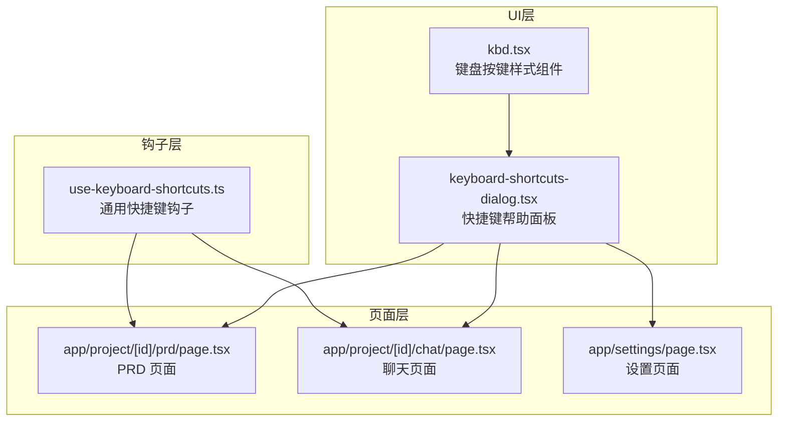
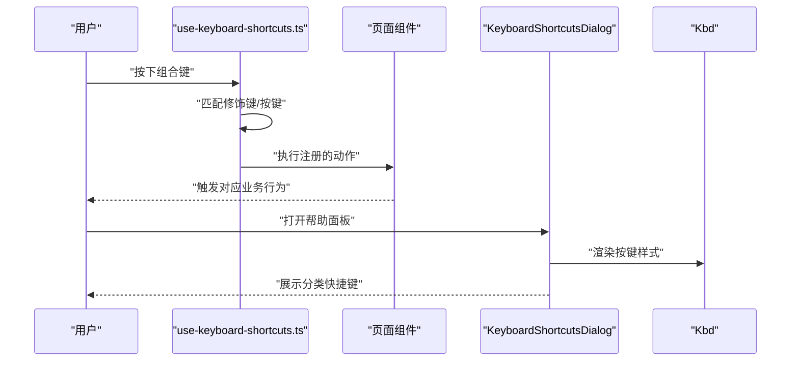
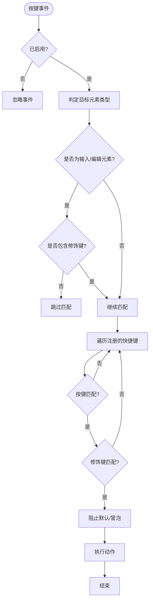
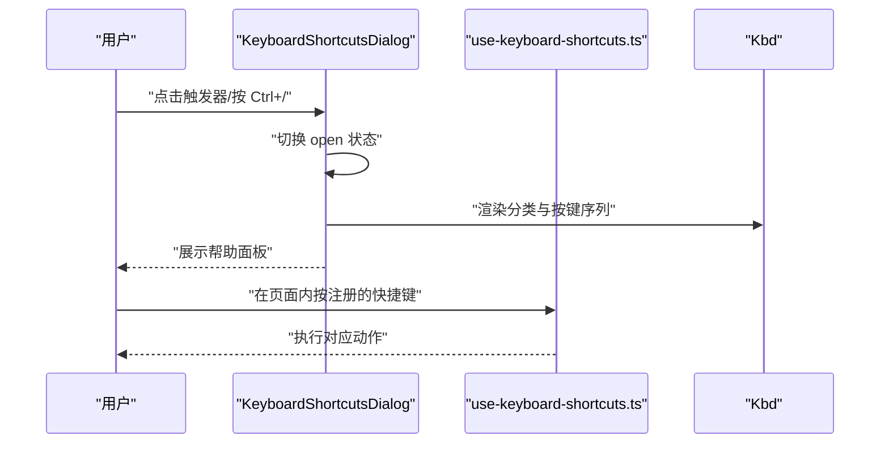
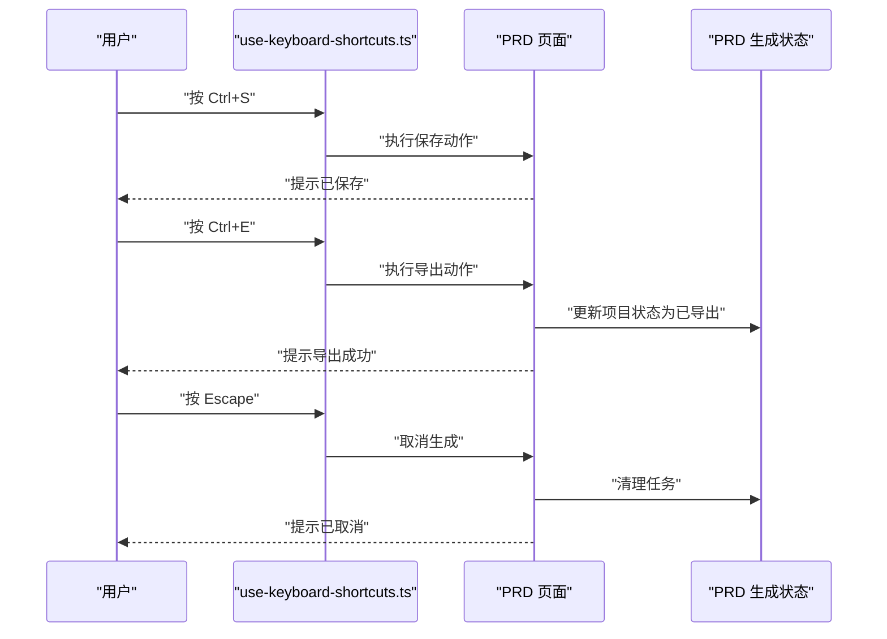
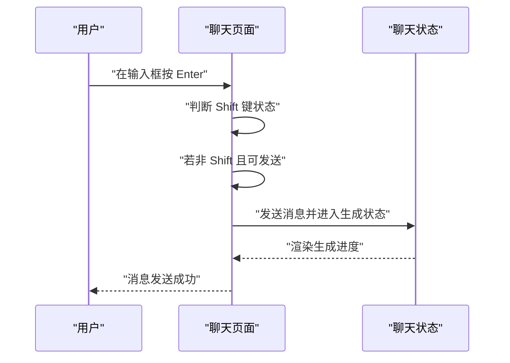
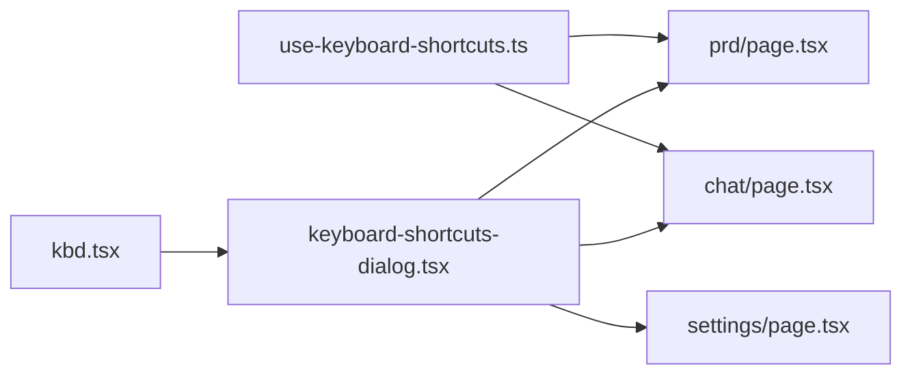

# 键盘快捷键

<cite>
**本文引用的文件**
- [use-keyboard-shortcuts.ts](file://prd-generator/src/hooks/use-keyboard-shortcuts.ts)
- [keyboard-shortcuts-dialog.tsx](file://prd-generator/src/components/keyboard-shortcuts-dialog.tsx)
- [kbd.tsx](file://prd-generator/src/components/ui/kbd.tsx)
- [prd/page.tsx](file://prd-generator/src/app/project/[id]/prd/page.tsx)
- [chat/page.tsx](file://prd-generator/src/app/project/[id]/chat/page.tsx)
- [settings/page.tsx](file://prd-generator/src/app/settings/page.tsx)
</cite>

## 目录
1. [简介](#简介)
2. [项目结构](#项目结构)
3. [核心组件](#核心组件)
4. [架构总览](#架构总览)
5. [详细组件分析](#详细组件分析)
6. [依赖关系分析](#依赖关系分析)
7. [性能考量](#性能考量)
8. [故障排查指南](#故障排查指南)
9. [结论](#结论)

## 简介
本文件系统性梳理“键盘快捷键”在项目中的设计与实现，包括：
- 通用快捷键钩子与帮助面板
- 在不同页面中的快捷键使用策略
- 快捷键行为与输入框交互的边界处理
- 可扩展的快捷键注册机制与最佳实践

目标读者既包括开发者，也包括希望了解如何高效操作界面的普通用户。

## 项目结构
键盘快捷键能力主要由三部分组成：
- 钩子层：提供统一的快捷键监听与匹配逻辑
- UI 层：帮助面板展示与触发
- 页面层：在具体页面中注册业务快捷键

图表来源
- [use-keyboard-shortcuts.ts](file://prd-generator/src/hooks/use-keyboard-shortcuts.ts#L1-L95)
- [keyboard-shortcuts-dialog.tsx](file://prd-generator/src/components/keyboard-shortcuts-dialog.tsx#L1-L107)
- [kbd.tsx](file://prd-generator/src/components/ui/kbd.tsx#L1-L25)
- [prd/page.tsx](file://prd-generator/src/app/project/[id]/prd/page.tsx#L114-L158)
- [chat/page.tsx](file://prd-generator/src/app/project/[id]/chat/page.tsx#L533-L540)
- [settings/page.tsx](file://prd-generator/src/app/settings/page.tsx#L1-L363)

章节来源
- [use-keyboard-shortcuts.ts](file://prd-generator/src/hooks/use-keyboard-shortcuts.ts#L1-L95)
- [keyboard-shortcuts-dialog.tsx](file://prd-generator/src/components/keyboard-shortcuts-dialog.tsx#L1-L107)
- [kbd.tsx](file://prd-generator/src/components/ui/kbd.tsx#L1-L25)
- [prd/page.tsx](file://prd-generator/src/app/project/[id]/prd/page.tsx#L114-L158)
- [chat/page.tsx](file://prd-generator/src/app/project/[id]/chat/page.tsx#L533-L540)
- [settings/page.tsx](file://prd-generator/src/app/settings/page.tsx#L1-L363)

## 核心组件
- 通用快捷键钩子
  - 提供统一的键盘事件监听、修饰键匹配、输入框边界处理与动作执行
  - 支持启用/禁用开关，避免全局干扰
- 快捷键帮助面板
  - 展示分类化的快捷键列表，使用 Kbd 组件渲染按键
  - 支持通过 Ctrl+/ 快捷键快速打开/关闭
- 页面级快捷键注册
  - 在 PRD 页面注册保存、导出、取消生成、打开设置等快捷键
  - 在聊天页面注册回车发送等常用快捷键

章节来源
- [use-keyboard-shortcuts.ts](file://prd-generator/src/hooks/use-keyboard-shortcuts.ts#L1-L95)
- [keyboard-shortcuts-dialog.tsx](file://prd-generator/src/components/keyboard-shortcuts-dialog.tsx#L1-L107)
- [kbd.tsx](file://prd-generator/src/components/ui/kbd.tsx#L1-L25)
- [prd/page.tsx](file://prd-generator/src/app/project/[id]/prd/page.tsx#L114-L158)
- [chat/page.tsx](file://prd-generator/src/app/project/[id]/chat/page.tsx#L533-L540)

## 架构总览
快捷键系统采用“钩子 + 面板 + 页面注册”的分层设计：
- 钩子负责底层事件与匹配
- 面板负责展示与触发
- 页面负责业务快捷键注册与行为绑定

图表来源
- [use-keyboard-shortcuts.ts](file://prd-generator/src/hooks/use-keyboard-shortcuts.ts#L1-L95)
- [keyboard-shortcuts-dialog.tsx](file://prd-generator/src/components/keyboard-shortcuts-dialog.tsx#L1-L107)
- [kbd.tsx](file://prd-generator/src/components/ui/kbd.tsx#L1-L25)
- [prd/page.tsx](file://prd-generator/src/app/project/[id]/prd/page.tsx#L114-L158)

## 详细组件分析

### 通用快捷键钩子 use-keyboard-shortcuts
- 设计要点
  - 事件监听：在启用状态下为 window 注册 keydown 事件
  - 匹配规则：区分按键与修饰键（Ctrl/Cmd/Alt/Shift），大小写不敏感
  - 输入框边界：在输入类元素中默认忽略非修饰键组合；允许特定组合（如带 Ctrl/Cmd 或 Alt）生效
  - 动作执行：命中后阻止默认与冒泡，调用注册的动作
  - 启用控制：支持通过 enabled 参数动态开启/关闭
- 数据结构
  - KeyboardShortcut：包含 key、修饰键布尔标志、描述与动作
  - UseKeyboardShortcutsOptions：包含 shortcuts 数组与 enabled 标志
- 性能与健壮性
  - 使用 useCallback 缓存事件处理器，减少重复渲染
  - 使用 useEffect 注册/注销事件，避免内存泄漏
  - 修饰键匹配采用短路逻辑，降低分支成本

图表来源
- [use-keyboard-shortcuts.ts](file://prd-generator/src/hooks/use-keyboard-shortcuts.ts#L1-L95)

章节来源
- [use-keyboard-shortcuts.ts](file://prd-generator/src/hooks/use-keyboard-shortcuts.ts#L1-L95)

### 快捷键帮助面板 KeyboardShortcutsDialog
- 设计要点
  - 触发方式：支持通过外部触发器或默认的图标按钮；默认 Tooltip 提示“Ctrl+/”
  - 快捷键打开：监听 Ctrl+/（或 Cmd+/）组合键，切换面板开合
  - 展示内容：从钩子导出的分类常量读取，逐条渲染按键序列
  - 按键样式：使用 Kbd 组件统一渲染每个按键块
- 交互细节
  - 受控/非受控：支持外部 controlledOpen/onOpenChange 控制
  - 无障碍：结合 Tooltip 提供提示
- 适用范围
  - 在 PRD、聊天、设置等页面均可嵌入使用

图表来源
- [keyboard-shortcuts-dialog.tsx](file://prd-generator/src/components/keyboard-shortcuts-dialog.tsx#L1-L107)
- [kbd.tsx](file://prd-generator/src/components/ui/kbd.tsx#L1-L25)
- [use-keyboard-shortcuts.ts](file://prd-generator/src/hooks/use-keyboard-shortcuts.ts#L64-L95)

章节来源
- [keyboard-shortcuts-dialog.tsx](file://prd-generator/src/components/keyboard-shortcuts-dialog.tsx#L1-L107)
- [kbd.tsx](file://prd-generator/src/components/ui/kbd.tsx#L1-L25)
- [use-keyboard-shortcuts.ts](file://prd-generator/src/hooks/use-keyboard-shortcuts.ts#L64-L95)

### PRD 页面快捷键注册
- 注册位置：在 PRD 页面中通过 useMemo 定义一组业务快捷键，并调用 useKeyboardShortcuts 注册
- 快捷键清单
  - Ctrl+S：保存 PRD（若存在内容则提示成功）
  - Ctrl+E：导出 Markdown（若存在内容则导出并更新项目状态为已导出）
  - Escape：取消 PRD 生成（若处于生成中）
  - Ctrl+,：打开设置页面
- 行为说明
  - 与页面状态联动：保存/导出依赖 currentProject.prdContent；取消生成依赖 prd 任务状态
  - 导出后更新项目状态，便于后续流程识别

图表来源
- [prd/page.tsx](file://prd-generator/src/app/project/[id]/prd/page.tsx#L114-L158)
- [use-keyboard-shortcuts.ts](file://prd-generator/src/hooks/use-keyboard-shortcuts.ts#L1-L95)

章节来源
- [prd/page.tsx](file://prd-generator/src/app/project/[id]/prd/page.tsx#L114-L158)

### 聊天页面快捷键注册
- 注册位置：在聊天页面中通过 onKeyDown 处理回车发送消息
- 快捷键清单
  - Enter：发送消息（Shift+Enter 用于换行）
- 行为说明
  - 与输入框状态联动：在 isStreaming 时禁用发送
  - 与设置联动：若未配置 API Key，提示先配置

图表来源
- [chat/page.tsx](file://prd-generator/src/app/project/[id]/chat/page.tsx#L533-L540)

章节来源
- [chat/page.tsx](file://prd-generator/src/app/project/[id]/chat/page.tsx#L533-L540)

### 设置页面快捷键
- 注册位置：设置页面未直接注册业务快捷键
- 与快捷键系统的关系：可配合全局帮助面板使用，或在该页面内通过其他交互方式（按钮/菜单）完成设置切换

章节来源
- [settings/page.tsx](file://prd-generator/src/app/settings/page.tsx#L1-L363)

## 依赖关系分析
- 钩子依赖
  - use-keyboard-shortcuts.ts 依赖 React 的 useEffect/useCallback
  - 通过 SHORTCUT_CATEGORIES 为帮助面板提供数据
- UI 依赖
  - keyboard-shortcuts-dialog.tsx 依赖 Dialog/Tooltip/Button/Kbd
  - kbd.tsx 为帮助面板提供统一按键样式
- 页面依赖
  - PRD 页面依赖 useKeyboardShortcuts 与 PRD 生成状态
  - 聊天页面依赖 onKeyDown 与聊天状态
  - 设置页面未直接使用快捷键钩子

图表来源
- [use-keyboard-shortcuts.ts](file://prd-generator/src/hooks/use-keyboard-shortcuts.ts#L1-L95)
- [keyboard-shortcuts-dialog.tsx](file://prd-generator/src/components/keyboard-shortcuts-dialog.tsx#L1-L107)
- [kbd.tsx](file://prd-generator/src/components/ui/kbd.tsx#L1-L25)
- [prd/page.tsx](file://prd-generator/src/app/project/[id]/prd/page.tsx#L114-L158)
- [chat/page.tsx](file://prd-generator/src/app/project/[id]/chat/page.tsx#L533-L540)
- [settings/page.tsx](file://prd-generator/src/app/settings/page.tsx#L1-L363)

章节来源
- [use-keyboard-shortcuts.ts](file://prd-generator/src/hooks/use-keyboard-shortcuts.ts#L1-L95)
- [keyboard-shortcuts-dialog.tsx](file://prd-generator/src/components/keyboard-shortcuts-dialog.tsx#L1-L107)
- [kbd.tsx](file://prd-generator/src/components/ui/kbd.tsx#L1-L25)
- [prd/page.tsx](file://prd-generator/src/app/project/[id]/prd/page.tsx#L114-L158)
- [chat/page.tsx](file://prd-generator/src/app/project/[id]/chat/page.tsx#L533-L540)
- [settings/page.tsx](file://prd-generator/src/app/settings/page.tsx#L1-L363)

## 性能考量
- 事件监听
  - 仅在启用状态下注册 keydown 事件，避免全局干扰
  - 使用 useCallback 缓存事件处理器，减少渲染开销
- 匹配效率
  - 修饰键匹配采用短路逻辑，按键匹配大小写不敏感，降低分支成本
- 输入框边界
  - 在输入类元素中默认忽略非修饰键组合，减少误触概率
- 面板渲染
  - 帮助面板按需打开，避免常驻 DOM

[本节为通用指导，无需列出具体文件来源]

## 故障排查指南
- 快捷键无效
  - 检查是否在启用状态（enabled）
  - 检查是否在输入类元素中使用了非修饰键组合
  - 检查是否与其他全局事件冲突
- 帮助面板无法打开
  - 检查 Ctrl+/（或 Cmd+/）是否被系统/浏览器占用
  - 检查 KeyboardShortcutsDialog 的 open 状态是否被外部控制
- 页面快捷键冲突
  - 在 PRD/聊天页面中，确认当前状态（如生成中、输入框为空）是否影响快捷键执行
  - 若需要在其他页面增加快捷键，参考 PRD 页面的注册方式，使用 useMemo 定义 KeyboardShortcut 并调用 useKeyboardShortcuts

章节来源
- [use-keyboard-shortcuts.ts](file://prd-generator/src/hooks/use-keyboard-shortcuts.ts#L1-L95)
- [keyboard-shortcuts-dialog.tsx](file://prd-generator/src/components/keyboard-shortcuts-dialog.tsx#L1-L107)
- [prd/page.tsx](file://prd-generator/src/app/project/[id]/prd/page.tsx#L114-L158)
- [chat/page.tsx](file://prd-generator/src/app/project/[id]/chat/page.tsx#L533-L540)

## 结论
- 本项目通过“通用钩子 + 帮助面板 + 页面注册”的方式实现了灵活、可扩展的键盘快捷键体系
- 钩子层提供统一的事件处理与匹配逻辑，UI 层提供一致的帮助展示，页面层聚焦业务快捷键
- 建议在新增页面时遵循现有模式：使用 useMemo 定义 KeyboardShortcut，调用 useKeyboardShortcuts 注册，并在需要时提供帮助面板入口

[本节为总结性内容，无需列出具体文件来源]