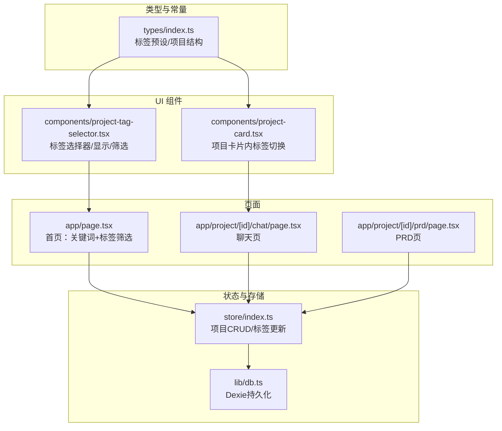
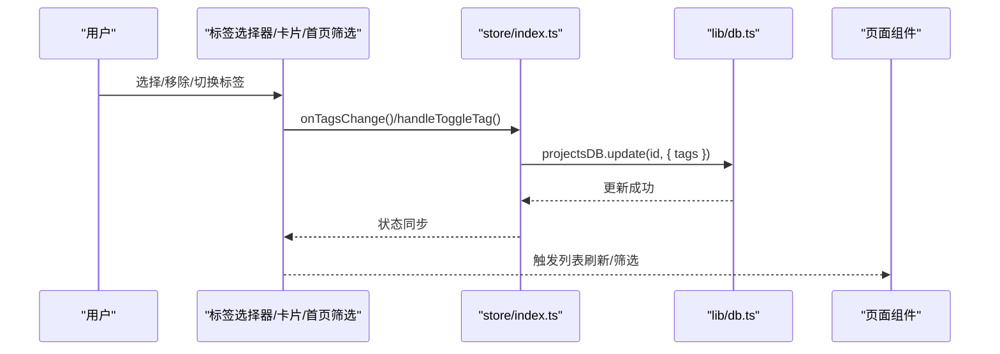
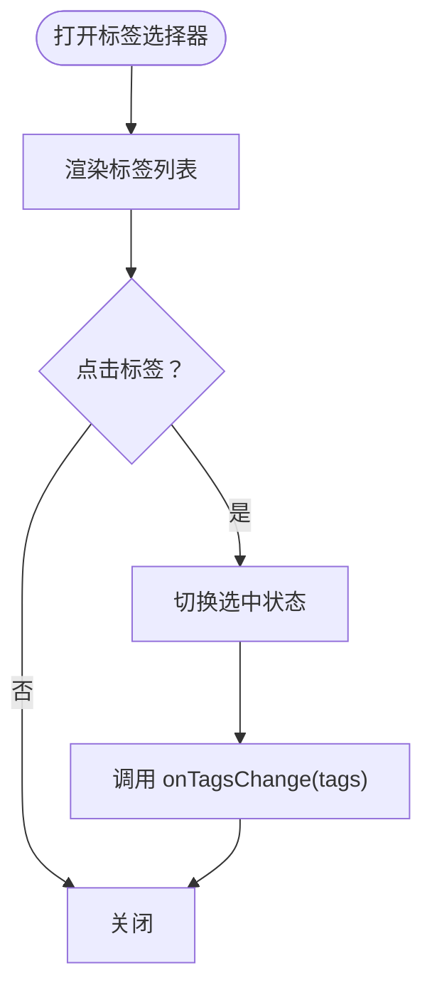
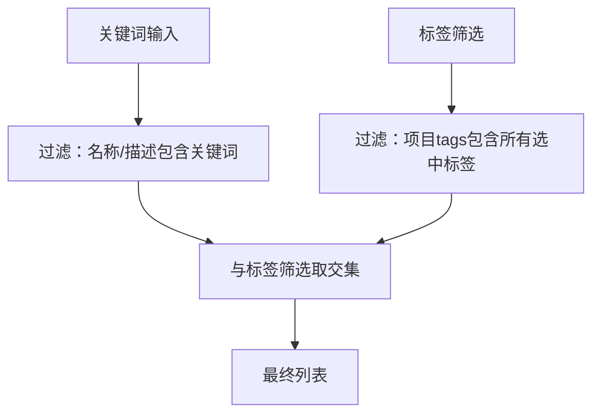
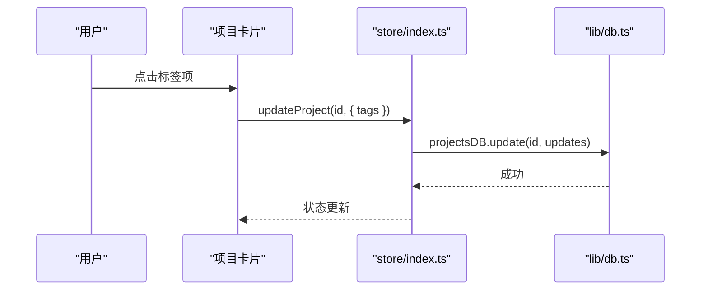
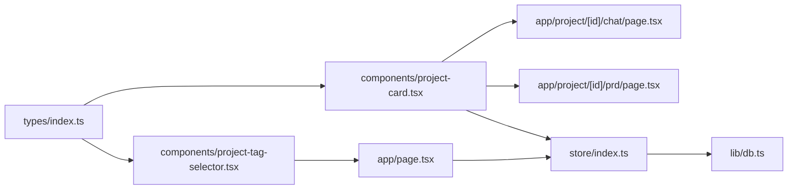

# 项目标签管理

<cite>
**本文引用的文件**
- [project-tag-selector.tsx](file://prd-generator/src/components/project-tag-selector.tsx)
- [project-card.tsx](file://prd-generator/src/components/project-card.tsx)
- [page.tsx（首页）](file://prd-generator/src/app/page.tsx)
- [index.ts（类型定义）](file://prd-generator/src/types/index.ts)
- [index.ts（store）](file://prd-generator/src/store/index.ts)
- [db.ts（数据库）](file://prd-generator/src/lib/db.ts)
- [page.tsx（项目聊天页）](file://prd-generator/src/app/project/[id]/chat/page.tsx)
- [page.tsx（项目PRD页）](file://prd-generator/src/app/project/[id]/prd/page.tsx)
</cite>

## 目录
1. [简介](#简介)
2. [项目结构](#项目结构)
3. [核心组件](#核心组件)
4. [架构总览](#架构总览)
5. [详细组件分析](#详细组件分析)
6. [依赖关系分析](#依赖关系分析)
7. [性能考量](#性能考量)
8. [故障排查指南](#故障排查指南)
9. [结论](#结论)

## 简介
本文件系统性梳理“项目标签管理”在该仓库中的实现与使用方式，涵盖标签预设、标签选择器组件、标签在项目卡片中的展示与切换、首页标签筛选、以及标签在项目数据结构中的持久化与查询路径。目标是帮助开发者快速理解标签的来源、流转与落地，便于扩展或维护。

## 项目结构
围绕“项目标签”的关键文件组织如下：
- 类型与常量：标签预设、项目数据结构中对标签字段的定义
- UI 组件：标签选择器、标签显示、首页标签筛选
- 页面：首页、项目聊天页、项目PRD页
- 状态与存储：Zustand store 的项目 CRUD、标签更新；Dexie 数据库的持久化

图表来源
- [index.ts（类型定义）](file://prd-generator/src/types/index.ts#L1-L120)
- [project-tag-selector.tsx](file://prd-generator/src/components/project-tag-selector.tsx#L1-L120)
- [project-card.tsx](file://prd-generator/src/components/project-card.tsx#L1-L120)
- [page.tsx（首页）](file://prd-generator/src/app/page.tsx#L1-L120)
- [index.ts（store）](file://prd-generator/src/store/index.ts#L117-L136)
- [db.ts（数据库）](file://prd-generator/src/lib/db.ts#L45-L82)

章节来源
- [index.ts（类型定义）](file://prd-generator/src/types/index.ts#L1-L120)
- [project-tag-selector.tsx](file://prd-generator/src/components/project-tag-selector.tsx#L1-L120)
- [project-card.tsx](file://prd-generator/src/components/project-card.tsx#L1-L120)
- [page.tsx（首页）](file://prd-generator/src/app/page.tsx#L1-L120)
- [index.ts（store）](file://prd-generator/src/store/index.ts#L117-L136)
- [db.ts（数据库）](file://prd-generator/src/lib/db.ts#L45-L82)

## 核心组件
- 标签预设与类型
  - 标签预设来源于类型定义文件，包含标签 id、标签名、颜色等
  - 项目结构中包含 tags 字段，类型为标签 id 的联合类型数组
- 标签选择器组件
  - 提供弹出式选择器、标签列表展示、首页标签筛选器三种形态
  - 通过回调 onTagsChange/onTagsChange 实现双向绑定
- 项目卡片中的标签切换
  - 在卡片下拉菜单中直接切换标签，调用 store 的 updateProject 更新标签
- 首页标签筛选
  - 首页同时支持关键词与标签筛选，标签筛选采用“全包含”策略
- 数据持久化
  - store 的 updateProject 会写入数据库；首页搜索与筛选在内存中进行

章节来源
- [index.ts（类型定义）](file://prd-generator/src/types/index.ts#L1-L120)
- [project-tag-selector.tsx](file://prd-generator/src/components/project-tag-selector.tsx#L1-L120)
- [project-card.tsx](file://prd-generator/src/components/project-card.tsx#L70-L85)
- [page.tsx（首页）](file://prd-generator/src/app/page.tsx#L28-L41)
- [index.ts（store）](file://prd-generator/src/store/index.ts#L117-L136)
- [db.ts（数据库）](file://prd-generator/src/lib/db.ts#L61-L67)

## 架构总览
标签管理的端到端流程如下：
- 标签来源：类型定义中的标签预设
- 交互入口：标签选择器组件（弹出式）、标签显示组件、首页标签筛选器
- 数据入口：项目卡片内切换标签，触发 store 更新
- 数据出口：store 调用数据库接口持久化；首页根据关键词与标签共同筛选

图表来源
- [project-tag-selector.tsx](file://prd-generator/src/components/project-tag-selector.tsx#L21-L40)
- [project-card.tsx](file://prd-generator/src/components/project-card.tsx#L74-L81)
- [page.tsx（首页）](file://prd-generator/src/app/page.tsx#L28-L41)
- [index.ts（store）](file://prd-generator/src/store/index.ts#L117-L136)
- [db.ts（数据库）](file://prd-generator/src/lib/db.ts#L61-L67)

## 详细组件分析

### 标签预设与类型
- 标签预设：包含 id、label、color 等字段，用于 UI 展示与筛选
- 项目类型：Project 结构中包含 tags 字段，类型为标签 id 的联合类型数组
- 作用：为标签选择器、标签显示、首页筛选提供统一的数据来源与类型约束

章节来源
- [index.ts（类型定义）](file://prd-generator/src/types/index.ts#L1-L120)

### 标签选择器组件（弹出式）
- 功能要点
  - 接收 selectedTags 与 onTagsChange，支持多选
  - 支持紧凑模式，用于小尺寸场景
  - 通过 Popover 展示标签列表，点击切换选中状态
- 交互细节
  - 选中态高亮，右侧显示勾选图标
  - 支持移除单个标签（在某些使用场景）

图表来源
- [project-tag-selector.tsx](file://prd-generator/src/components/project-tag-selector.tsx#L21-L108)

章节来源
- [project-tag-selector.tsx](file://prd-generator/src/components/project-tag-selector.tsx#L21-L108)

### 标签显示组件（用于展示标签列表）
- 功能要点
  - 接收 tags 数组，最多显示 N 个，超出部分以 +N 形式提示
  - 支持可选的移除回调（onRemove），用于允许从外部移除标签
- 适用场景
  - 项目卡片、列表项、详情页等位置展示项目标签

章节来源
- [project-tag-selector.tsx](file://prd-generator/src/components/project-tag-selector.tsx#L112-L169)

### 首页标签筛选器
- 功能要点
  - 接收 selectedTags 与 onTagsChange
  - 采用“全包含”策略：只有当项目 tags 包含 selectedTags 中的所有标签时才命中
  - 支持一键清除筛选
- 与关键词筛选的组合
  - 首页同时支持关键词与标签筛选，二者取交集

图表来源
- [page.tsx（首页）](file://prd-generator/src/app/page.tsx#L28-L41)

章节来源
- [page.tsx（首页）](file://prd-generator/src/app/page.tsx#L28-L41)

### 项目卡片内的标签切换
- 功能要点
  - 在卡片下拉菜单中展示标签列表
  - 点击切换标签，调用 updateProject 更新 tags
  - 切换时阻止事件冒泡，避免误触卡片跳转
- 与数据库交互
  - updateProject 会调用 projectsDB.update 持久化

图表来源
- [project-card.tsx](file://prd-generator/src/components/project-card.tsx#L74-L81)
- [index.ts（store）](file://prd-generator/src/store/index.ts#L117-L136)
- [db.ts（数据库）](file://prd-generator/src/lib/db.ts#L61-L67)

章节来源
- [project-card.tsx](file://prd-generator/src/components/project-card.tsx#L74-L81)
- [index.ts（store）](file://prd-generator/src/store/index.ts#L117-L136)
- [db.ts（数据库）](file://prd-generator/src/lib/db.ts#L61-L67)

### 聊天页与PRD页中的标签使用
- 聊天页
  - 项目标签在聊天页中未直接出现，但项目数据结构包含 tags 字段，后续可扩展在聊天页展示或筛选
- PRD页
  - 项目标签在PRD页中未直接出现，但项目数据结构包含 tags 字段，后续可扩展在PRD页展示或筛选

章节来源
- [page.tsx（项目聊天页）](file://prd-generator/src/app/project/[id]/chat/page.tsx#L1-L120)
- [page.tsx（项目PRD页）](file://prd-generator/src/app/project/[id]/prd/page.tsx#L1-L120)

## 依赖关系分析
- 组件与类型
  - 标签选择器与标签显示组件依赖类型定义中的标签预设与 ProjectTagId
- 组件与页面
  - 首页通过 ProjectTagFilter 实现标签筛选
  - 项目卡片通过 handleToggleTag 实现标签切换
- 页面与状态
  - 首页与项目卡片均通过 useProjectStore 的 updateProject 更新标签
- 状态与数据库
  - store 的 updateProject 调用 projectsDB.update 持久化

图表来源
- [index.ts（类型定义）](file://prd-generator/src/types/index.ts#L1-L120)
- [project-tag-selector.tsx](file://prd-generator/src/components/project-tag-selector.tsx#L1-L120)
- [project-card.tsx](file://prd-generator/src/components/project-card.tsx#L1-L120)
- [page.tsx（首页）](file://prd-generator/src/app/page.tsx#L1-L120)
- [page.tsx（项目聊天页）](file://prd-generator/src/app/project/[id]/chat/page.tsx#L1-L120)
- [page.tsx（项目PRD页）](file://prd-generator/src/app/project/[id]/prd/page.tsx#L1-L120)
- [index.ts（store）](file://prd-generator/src/store/index.ts#L117-L136)
- [db.ts（数据库）](file://prd-generator/src/lib/db.ts#L61-L67)

章节来源
- [index.ts（类型定义）](file://prd-generator/src/types/index.ts#L1-L120)
- [project-tag-selector.tsx](file://prd-generator/src/components/project-tag-selector.tsx#L1-L120)
- [project-card.tsx](file://prd-generator/src/components/project-card.tsx#L1-L120)
- [page.tsx（首页）](file://prd-generator/src/app/page.tsx#L1-L120)
- [page.tsx（项目聊天页）](file://prd-generator/src/app/project/[id]/chat/page.tsx#L1-L120)
- [page.tsx（项目PRD页）](file://prd-generator/src/app/project/[id]/prd/page.tsx#L1-L120)
- [index.ts（store）](file://prd-generator/src/store/index.ts#L117-L136)
- [db.ts（数据库）](file://prd-generator/src/lib/db.ts#L61-L67)

## 性能考量
- 首页筛选
  - 首页的关键词与标签筛选在内存中进行，复杂度约为 O(N)（N 为项目数）
  - 若项目规模较大，建议考虑：
    - 前端索引（如按标签建立索引）
    - 后端接口分页与服务端筛选
- 标签选择器
  - 标签列表较小，渲染成本低
  - 若未来标签数量增多，可考虑虚拟化列表或分页
- 数据持久化
  - store 的 updateProject 会调用数据库更新，频繁切换标签会产生多次写入
  - 可通过防抖或批量更新策略降低写入频率（当前实现为逐次更新）

[本节为通用建议，不直接分析具体文件]

## 故障排查指南
- 标签切换无效
  - 检查 onTagsChange 回调是否正确传递至标签选择器
  - 检查项目卡片 handleToggleTag 是否调用了 updateProject
- 标签未持久化
  - 确认 store 的 updateProject 是否被调用
  - 确认 projectsDB.update 是否返回成功
- 首页筛选不生效
  - 确认 selectedTags 是否正确传入 ProjectTagFilter
  - 确认首页筛选逻辑中“全包含”策略符合预期
- 标签颜色/文案不显示
  - 确认标签预设中的 color 与 label 是否正确
  - 确认标签 id 与预设一致

章节来源
- [project-tag-selector.tsx](file://prd-generator/src/components/project-tag-selector.tsx#L21-L108)
- [project-card.tsx](file://prd-generator/src/components/project-card.tsx#L74-L81)
- [page.tsx（首页）](file://prd-generator/src/app/page.tsx#L28-L41)
- [index.ts（store）](file://prd-generator/src/store/index.ts#L117-L136)
- [db.ts（数据库）](file://prd-generator/src/lib/db.ts#L61-L67)

## 结论
该项目的“项目标签管理”以类型定义为源头，通过标签选择器、标签显示与首页筛选器形成完整的交互闭环，并通过 store 与数据库实现持久化。当前实现简洁清晰，满足基础标签管理需求。若需扩展，可在以下方向进行增强：
- 在聊天页与PRD页增加标签展示或筛选
- 优化首页筛选性能（索引/服务端筛选）
- 增加标签分类/层级或标签搜索
- 增强标签切换的批量更新与防抖策略