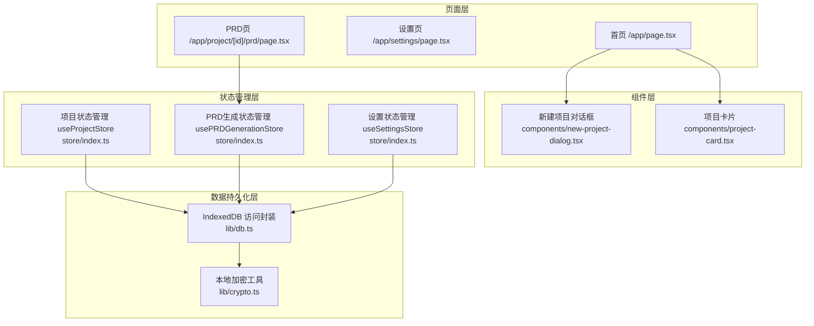
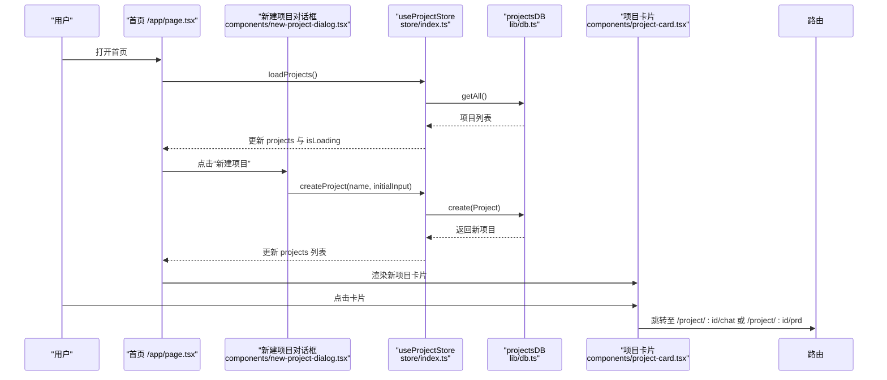
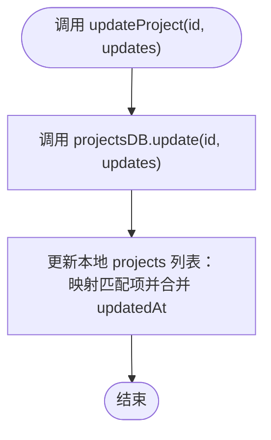
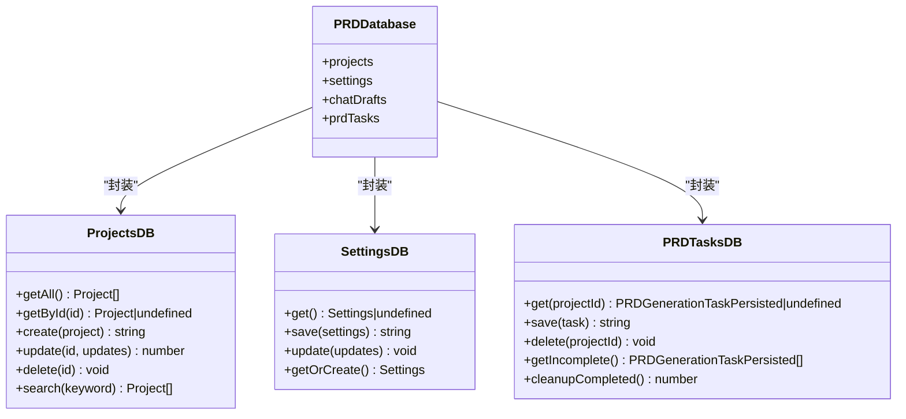
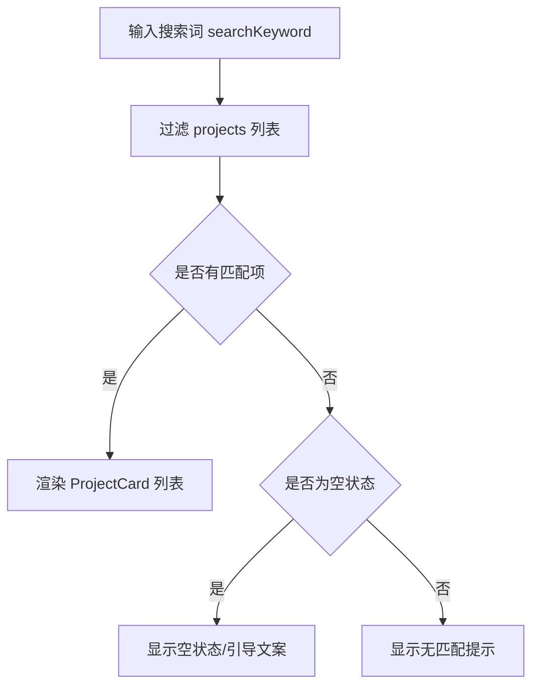
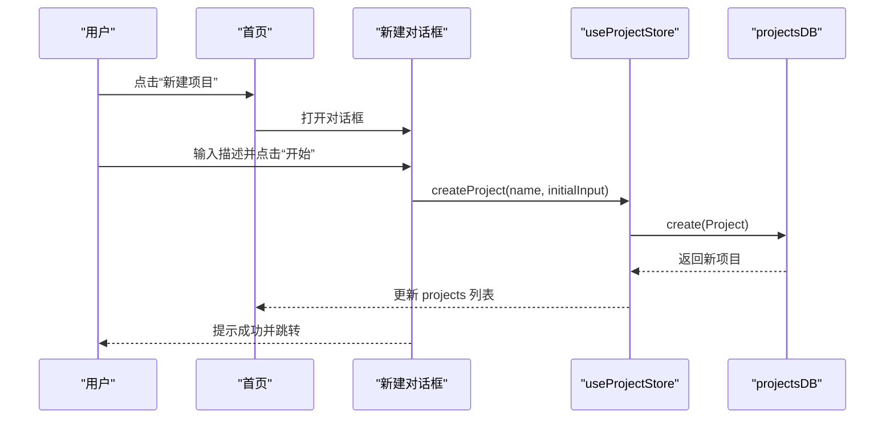
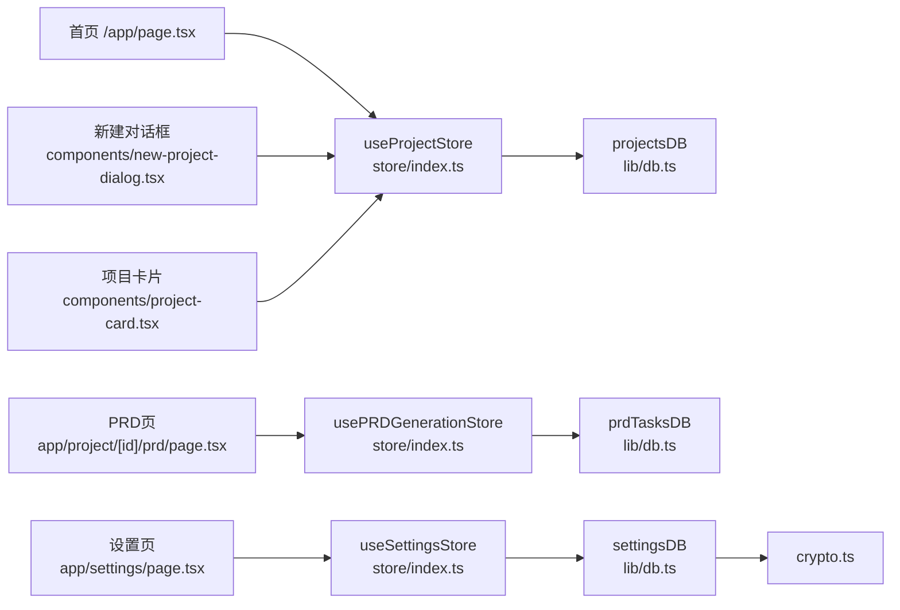

# 项目管理模块

<cite>
**本文引用的文件**
- [store/index.ts](file://prd-generator/src/store/index.ts)
- [types/index.ts](file://prd-generator/src/types/index.ts)
- [lib/db.ts](file://prd-generator/src/lib/db.ts)
- [lib/crypto.ts](file://prd-generator/src/lib/crypto.ts)
- [components/project-card.tsx](file://prd-generator/src/components/project-card.tsx)
- [components/new-project-dialog.tsx](file://prd-generator/src/components/new-project-dialog.tsx)
- [app/page.tsx](file://prd-generator/src/app/page.tsx)
- [app/settings/page.tsx](file://prd-generator/src/app/settings/page.tsx)
- [app/project/[id]/prd/page.tsx](file://prd-generator/src/app/project/[id]/prd/page.tsx)
</cite>

## 目录
1. [简介](#简介)
2. [项目结构](#项目结构)
3. [核心组件](#核心组件)
4. [架构总览](#架构总览)
5. [详细组件分析](#详细组件分析)
6. [依赖关系分析](#依赖关系分析)
7. [性能考量](#性能考量)
8. [故障排查指南](#故障排查指南)
9. [结论](#结论)

## 简介
本章节系统性介绍 PRDbot 的项目管理功能，重点围绕以下目标展开：
- 通过 useProjectStore 实现项目的创建、加载、更新与删除；
- 解释 projectsDB 在 IndexedDB 中的数据持久化机制；
- 描述首页项目列表的展示逻辑、搜索过滤功能以及 ProjectCard 组件的交互设计；
- 结合 Project 类型定义，阐述项目元数据（状态、进度、模型选择）的结构与用途；
- 提供从用户点击“新建项目”到项目成功保存的完整流程示例，并说明异常处理与性能优化策略。

## 项目结构
项目采用按功能域划分的目录组织方式，项目管理相关的核心文件如下：
- 状态管理：store/index.ts
- 类型定义：types/index.ts
- 数据持久化：lib/db.ts、lib/crypto.ts
- 页面与组件：components/project-card.tsx、components/new-project-dialog.tsx、app/page.tsx、app/settings/page.tsx、app/project/[id]/prd/page.tsx

图表来源
- [store/index.ts](file://prd-generator/src/store/index.ts#L1-L208)
- [lib/db.ts](file://prd-generator/src/lib/db.ts#L1-L209)
- [lib/crypto.ts](file://prd-generator/src/lib/crypto.ts#L1-L107)
- [components/new-project-dialog.tsx](file://prd-generator/src/components/new-project-dialog.tsx#L1-L107)
- [components/project-card.tsx](file://prd-generator/src/components/project-card.tsx#L1-L128)
- [app/page.tsx](file://prd-generator/src/app/page.tsx#L1-L110)
- [app/settings/page.tsx](file://prd-generator/src/app/settings/page.tsx#L1-L304)
- [app/project/[id]/prd/page.tsx](file://prd-generator/src/app/project/[id]/prd/page.tsx#L1-L480)

章节来源
- [store/index.ts](file://prd-generator/src/store/index.ts#L1-L208)
- [lib/db.ts](file://prd-generator/src/lib/db.ts#L1-L209)

## 核心组件
本节聚焦项目管理的关键能力与数据结构。

- useProjectStore
  - 负责项目集合、当前项目、搜索关键字与加载状态的管理；
  - 提供 loadProjects、createProject、loadProject、updateProject、deleteProject 等操作；
  - 提供派生状态 getCurrentProject，便于从 projects 列表派生当前项目对象；
  - 提供 addMessage、updatePRDContent、setProjectStatus 等与对话与 PRD 内容相关的辅助方法。

- projectsDB（IndexedDB 访问封装）
  - 提供 getAll、getById、create、update、delete、search 等方法；
  - 通过 Dexie 定义 projects 表结构与索引；版本迁移中新增 chatDrafts 与 prdTasks；
  - 搜索基于项目名称与初始输入进行模糊匹配。

- Project 类型与元数据
  - Project 包含 id、name、createdAt、updatedAt、status、initialInput、conversation、prdContent、metadata；
  - metadata 包含 questionCount、progress、selectedModel，分别用于统计问题数量、进度百分比与模型选择；
  - ProjectStatus 取值为 exploring、generated、exported，用于表示项目所处阶段。

- 项目卡片 ProjectCard
  - 展示项目名称、状态徽章、初始描述、更新时间；
  - 在 exploring 状态下显示进度条与问题计数；
  - 提供继续编辑/查看 PRD、导出、删除等交互入口。

章节来源
- [store/index.ts](file://prd-generator/src/store/index.ts#L1-L208)
- [lib/db.ts](file://prd-generator/src/lib/db.ts#L1-L209)
- [types/index.ts](file://prd-generator/src/types/index.ts#L1-L120)
- [components/project-card.tsx](file://prd-generator/src/components/project-card.tsx#L1-L128)

## 架构总览
项目管理的端到端流程由“页面/组件 -> 状态管理 -> 数据持久化 -> UI 更新”构成，其中状态管理采用 Zustand，数据持久化采用 Dexie + IndexedDB，并对敏感设置进行本地加密。

图表来源
- [app/page.tsx](file://prd-generator/src/app/page.tsx#L1-L110)
- [components/new-project-dialog.tsx](file://prd-generator/src/components/new-project-dialog.tsx#L1-L107)
- [store/index.ts](file://prd-generator/src/store/index.ts#L38-L120)
- [lib/db.ts](file://prd-generator/src/lib/db.ts#L35-L72)
- [components/project-card.tsx](file://prd-generator/src/components/project-card.tsx#L1-L128)

## 详细组件分析

### useProjectStore：项目 CRUD 与派生状态
- 状态字段
  - projects：项目数组；
  - currentProjectId：当前项目 ID（派生 currentProject）；
  - isLoading：加载状态；
  - searchKeyword：搜索关键字。
- 关键方法
  - loadProjects：从 IndexedDB 读取项目并按 updatedAt 倒序排序；
  - createProject：生成 UUID、填充默认字段（状态 explorering、metadata）、写入 IndexedDB 并更新本地列表；
  - loadProject：根据 ID 读取项目，若不在本地列表则追加，同时设置 currentProjectId；
  - updateProject：更新指定字段并自动更新 updatedAt；
  - deleteProject：删除项目并清理 currentProjectId；
  - setSearchKeyword：更新搜索关键字；
  - addMessage：向当前项目追加对话消息，计算 questionCount 与 progress；
  - updatePRDContent：更新 PRD 内容并刷新 updatedAt；
  - setProjectStatus：更新项目状态；
  - getCurrentProject：从 projects 与 currentProjectId 派生当前项目对象。
- 异常处理
  - 所有异步操作均包裹 try/catch，失败时打印错误并保持 isLoading 状态正确收尾；
- 性能优化
  - 仅更新 projects 列表，不重复写入整个数组，降低渲染压力；
  - 搜索在前端进行（基于 searchKeyword），避免频繁网络请求。

图表来源
- [store/index.ts](file://prd-generator/src/store/index.ts#L117-L136)

章节来源
- [store/index.ts](file://prd-generator/src/store/index.ts#L1-L208)

### projectsDB：IndexedDB 数据持久化机制
- 数据库与表
  - 数据库名：PRDGeneratorDB；
  - 表：projects、settings、chatDrafts、prdTasks；
  - 版本迁移：v1 初始结构，v2 新增 chatDrafts 与 prdTasks。
- 项目表索引
  - projects：主键 id，索引 name、createdAt、updatedAt、status；
  - 该索引支持首页按 updatedAt 倒序展示与按状态筛选。
- 查询与更新
  - getAll：按 updatedAt 倒序读取；
  - getById：按主键查询；
  - create：插入新项目；
  - update：原子更新并自动更新 updatedAt；
  - delete：按主键删除；
  - search：对 name 与 initialInput 进行大小写无关的包含匹配。
- 安全与隐私
  - settings 表的 API Keys 通过 lib/crypto.ts 进行本地加密/解密，避免明文存储。

图表来源
- [lib/db.ts](file://prd-generator/src/lib/db.ts#L1-L209)
- [lib/crypto.ts](file://prd-generator/src/lib/crypto.ts#L1-L107)

章节来源
- [lib/db.ts](file://prd-generator/src/lib/db.ts#L1-L209)
- [lib/crypto.ts](file://prd-generator/src/lib/crypto.ts#L1-L107)

### 首页项目列表与搜索过滤
- 列表渲染
  - 首次挂载时触发 loadProjects，随后将 projects 传递给 ProjectCard 渲染网格；
  - 若 isLoading 为真，渲染骨架屏占位；
  - 若无项目且无搜索词，显示引导文案与新建按钮；否则显示空状态提示。
- 搜索过滤
  - 通过 searchKeyword 对项目名称与初始输入进行包含匹配；
  - 该过滤在前端进行，避免网络往返。
- 交互
  - 点击卡片进入对应项目页（exploring 进入聊天页，其他进入 PRD 页）。

图表来源
- [app/page.tsx](file://prd-generator/src/app/page.tsx#L1-L110)
- [store/index.ts](file://prd-generator/src/store/index.ts#L138-L140)

章节来源
- [app/page.tsx](file://prd-generator/src/app/page.tsx#L1-L110)

### ProjectCard：交互设计与状态展示
- 展示内容
  - 名称、状态徽章（exploring/generate/exported）、初始描述、更新时间；
  - exploring 状态下显示进度条与问题计数；
- 交互行为
  - 继续编辑：跳转至 /project/:id/chat；
  - 查看 PRD：跳转至 /project/:id/prd；
  - 导出：带 export 参数跳转至导出流程；
  - 删除：确认后调用 deleteProject 并提示成功。
- 事件传播
  - 下拉菜单与按钮点击均阻止事件冒泡，避免误触卡片跳转。

章节来源
- [components/project-card.tsx](file://prd-generator/src/components/project-card.tsx#L1-L128)

### 项目元数据：状态、进度与模型选择
- Project.status
  - exploring：需求探索中；
  - generated：PRD 已生成；
  - exported：已导出。
- metadata
  - questionCount：用户提问次数；
  - progress：基于 questionCount 推导的进度百分比（上限 100）；
  - selectedModel：默认模型标识（来自 AI_MODELS）。
- 用途
  - 用于首页卡片进度展示与状态徽章；
  - 用于生成流程中的阶段推进与可视化反馈。

章节来源
- [types/index.ts](file://prd-generator/src/types/index.ts#L1-L120)

### 从“新建项目”到保存成功的完整流程
- 用户操作
  - 在首页点击“新建项目”，打开 NewProjectDialog；
  - 输入产品描述，点击“开始”；
- 前端处理
  - 校验输入非空，提取项目名称（首句或前 20 字符）；
  - 调用 useProjectStore.createProject(name, initialInput)；
- 状态与持久化
  - store 内部创建 Project 对象（默认状态 explorering、metadata 初始化）；
  - 调用 projectsDB.create 写入 IndexedDB；
  - 更新本地 projects 列表并将新项目置于首位；
- 跳转与反馈
  - 成功后弹出成功提示，关闭对话框，清空输入，跳转至 /project/:id/chat；
  - 失败时捕获异常并提示错误。

图表来源
- [components/new-project-dialog.tsx](file://prd-generator/src/components/new-project-dialog.tsx#L1-L107)
- [store/index.ts](file://prd-generator/src/store/index.ts#L62-L82)
- [lib/db.ts](file://prd-generator/src/lib/db.ts#L46-L49)

章节来源
- [components/new-project-dialog.tsx](file://prd-generator/src/components/new-project-dialog.tsx#L1-L107)
- [store/index.ts](file://prd-generator/src/store/index.ts#L62-L82)

## 依赖关系分析
- 组件与状态
  - 首页与项目卡片依赖 useProjectStore；
  - 新建对话框依赖 useProjectStore 与路由；
  - PRD 页依赖 usePRDGenerationStore 与 useProjectStore。
- 状态与数据层
  - useProjectStore 依赖 projectsDB；
  - usePRDGenerationStore 依赖 prdTasksDB；
  - useSettingsStore 依赖 settingsDB；
  - settingsDB 依赖 crypto 工具进行 API Keys 的本地加密/解密。
- 数据库版本与索引
  - Dexie 版本迁移确保新增表与索引可用；
  - projects 表索引支持首页排序与筛选。

图表来源
- [store/index.ts](file://prd-generator/src/store/index.ts#L1-L208)
- [lib/db.ts](file://prd-generator/src/lib/db.ts#L1-L209)
- [lib/crypto.ts](file://prd-generator/src/lib/crypto.ts#L1-L107)
- [components/new-project-dialog.tsx](file://prd-generator/src/components/new-project-dialog.tsx#L1-L107)
- [components/project-card.tsx](file://prd-generator/src/components/project-card.tsx#L1-L128)
- [app/page.tsx](file://prd-generator/src/app/page.tsx#L1-L110)
- [app/settings/page.tsx](file://prd-generator/src/app/settings/page.tsx#L1-L304)
- [app/project/[id]/prd/page.tsx](file://prd-generator/src/app/project/[id]/prd/page.tsx#L1-L480)

章节来源
- [store/index.ts](file://prd-generator/src/store/index.ts#L1-L208)
- [lib/db.ts](file://prd-generator/src/lib/db.ts#L1-L209)

## 性能考量
- 列表渲染优化
  - 仅更新 projects 列表，避免整体替换数组导致的昂贵重渲染；
  - 骨架屏在加载期间提供良好体验。
- 搜索与过滤
  - 前端过滤减少网络往返，适合中小规模项目集；
  - 若项目量增长，可考虑服务端分页或 IndexedDB 索引优化。
- 数据持久化
  - Dexie 基于 IndexedDB，避免跨标签页同步复杂度；
  - settings 的 API Keys 本地加密，兼顾安全性与性能。
- 生成与流式内容
  - PRD 生成采用 contentChunks 数组拼接，减少字符串拼接开销；
  - 生成任务状态持久化，支持中断恢复与清理策略。

[本节为通用指导，无需列出具体文件来源]

## 故障排查指南
- 新建项目失败
  - 检查输入是否为空；查看控制台错误日志；
  - 确认 IndexedDB 是否可用（部分隐私模式或受限环境可能禁用 IndexedDB）。
- 项目列表为空
  - 首次加载时 isLoading 为真，等待数据加载完成；
  - 若搜索词导致无匹配，尝试清空搜索词或调整关键词。
- 项目状态异常
  - exploring 状态下的进度条与问题计数由 addMessage 动态计算，检查对话消息是否正确追加；
  - generated/exported 状态变更由 setProjectStatus 触发，确认调用链路。
- 设置保存失败
  - settingsDB.update 会加密 API Keys 后写入，若失败需检查本地存储权限与网络状态（尽管设置主要本地化）。

章节来源
- [store/index.ts](file://prd-generator/src/store/index.ts#L117-L136)
- [lib/db.ts](file://prd-generator/src/lib/db.ts#L74-L137)
- [lib/crypto.ts](file://prd-generator/src/lib/crypto.ts#L1-L107)

## 结论
PRDbot 的项目管理模块以 Zustand 管理状态、以 Dexie + IndexedDB 实现本地持久化，配合清晰的类型定义与组件交互，实现了从项目创建、加载、更新到删除的完整闭环。首页列表与搜索过滤提供直观的项目浏览体验，ProjectCard 的交互设计简洁明确。通过元数据（状态、进度、模型选择）与对话消息的联动，系统能够有效驱动生成流程。建议在项目规模扩大后引入 IndexedDB 索引优化与服务端分页策略，以进一步提升性能与可维护性。