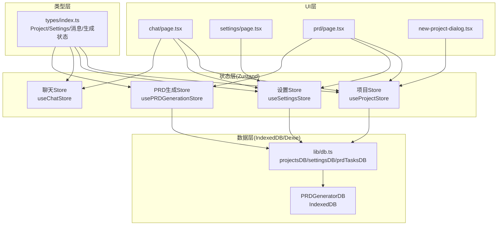
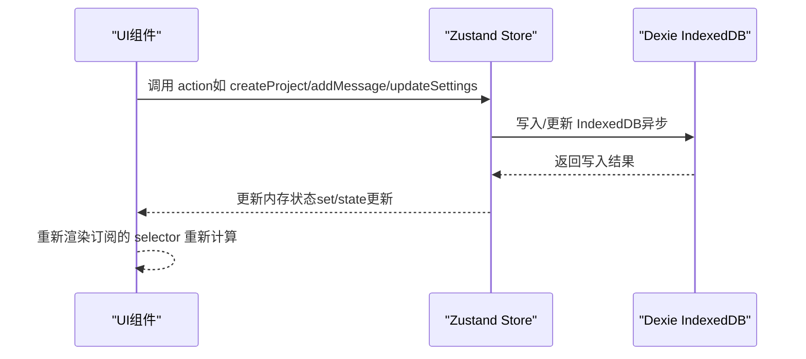
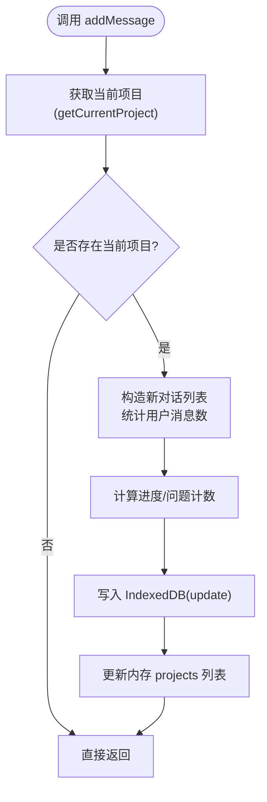
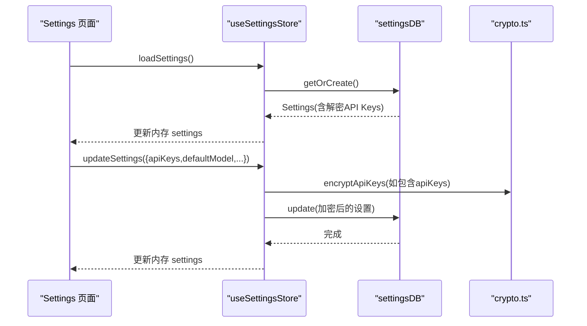
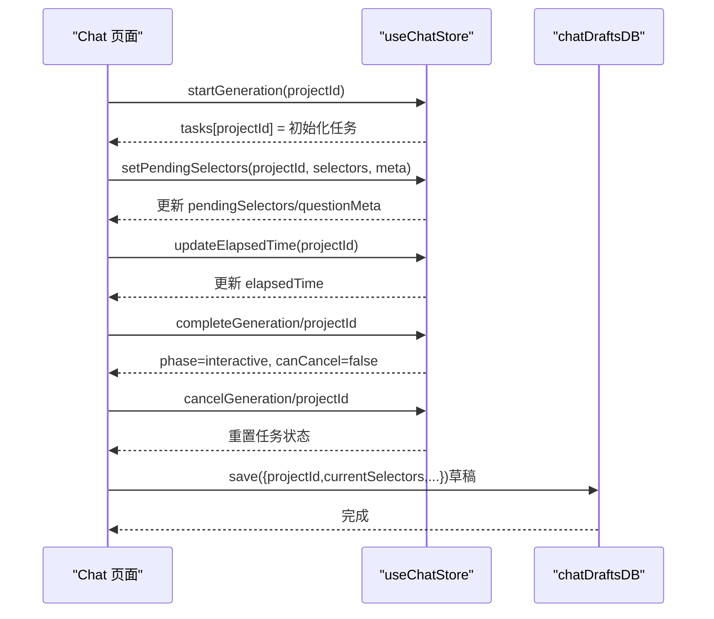
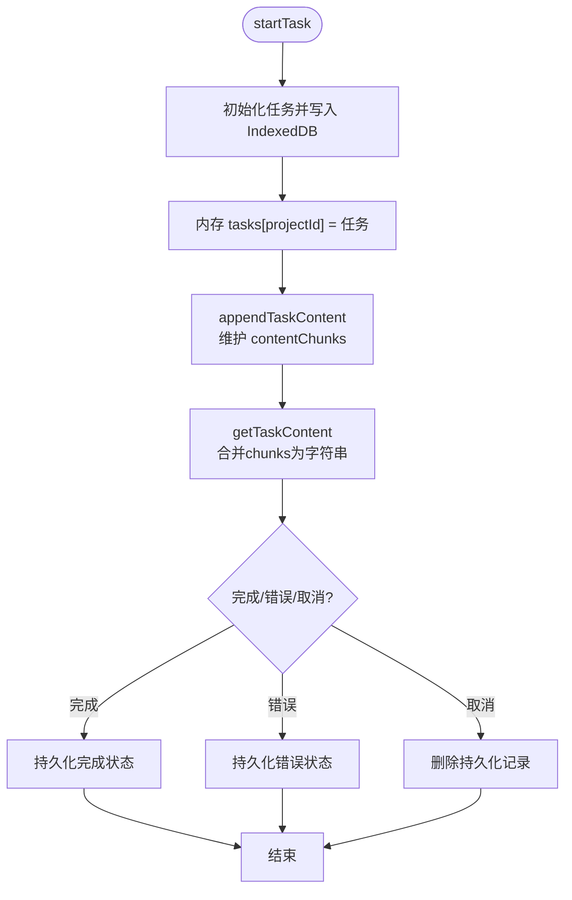
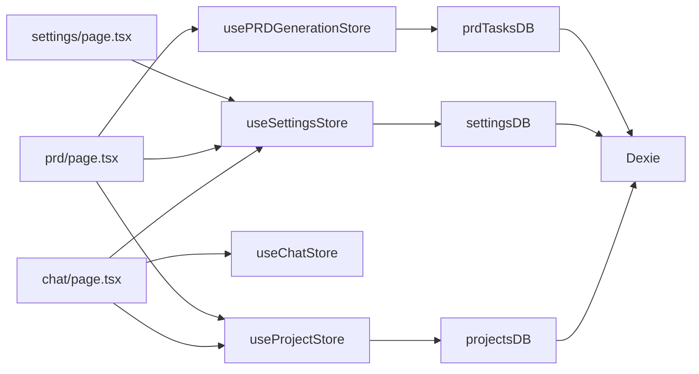

# 状态管理

<cite>
**本文引用的文件**
- [store/index.ts](file://prd-generator/src/store/index.ts)
- [db.ts](file://prd-generator/src/lib/db.ts)
- [types/index.ts](file://prd-generator/src/types/index.ts)
- [chat/page.tsx](file://prd-generator/src/app/project/[id]/chat/page.tsx)
- [settings/page.tsx](file://prd-generator/src/app/settings/page.tsx)
- [prd/page.tsx](file://prd-generator/src/app/project/[id]/prd/page.tsx)
- [new-project-dialog.tsx](file://prd-generator/src/components/new-project-dialog.tsx)
- [crypto.ts](file://prd-generator/src/lib/crypto.ts)
</cite>

## 目录
1. [简介](#简介)
2. [项目结构](#项目结构)
3. [核心组件](#核心组件)
4. [架构总览](#架构总览)
5. [详细组件分析](#详细组件分析)
6. [依赖分析](#依赖分析)
7. [性能考量](#性能考量)
8. [故障排查指南](#故障排查指南)
9. [结论](#结论)

## 简介
本文件系统性梳理应用的状态管理设计，重点围绕 ZUSTAND store 的组织方式与数据流，解释如何集中管理 Project、ConversationMessage、Settings 等核心数据模型，并阐述 action 如何被 UI 组件调用；同时阐明状态管理与本地数据库（IndexedDB/Dexie）的协作关系：UI 触发 action，action 更新内存状态并同步到 IndexedDB，从而保证“单一数据源”和状态变更的可预测性。

## 项目结构
- 状态层：Zustand store 定义于 store/index.ts，提供三类 store：
  - 项目 store：管理 Project 列表与当前项目派生状态
  - 设置 store：管理 Settings（含加密 API Keys）
  - 生成任务 store：按 projectId 隔离聊天与 PRD 生成任务状态
- 数据层：本地数据库封装于 lib/db.ts，基于 Dexie，提供 IndexedDB 访问接口
- 类型层：types/index.ts 定义了 Project、Settings、ConversationMessage、生成阶段与任务状态等核心类型
- UI 层：各页面与组件通过 useStore hooks 订阅 store 并调用 actions

图表来源
- [store/index.ts](file://prd-generator/src/store/index.ts#L1-L216)
- [db.ts](file://prd-generator/src/lib/db.ts#L1-L209)
- [types/index.ts](file://prd-generator/src/types/index.ts#L1-L243)
- [chat/page.tsx](file://prd-generator/src/app/project/[id]/chat/page.tsx#L1-L120)
- [settings/page.tsx](file://prd-generator/src/app/settings/page.tsx#L1-L120)
- [prd/page.tsx](file://prd-generator/src/app/project/[id]/prd/page.tsx#L1-L120)
- [new-project-dialog.tsx](file://prd-generator/src/components/new-project-dialog.tsx#L1-L45)

章节来源
- [store/index.ts](file://prd-generator/src/store/index.ts#L1-L216)
- [db.ts](file://prd-generator/src/lib/db.ts#L1-L209)
- [types/index.ts](file://prd-generator/src/types/index.ts#L1-L243)

## 核心组件
- 项目 Store（useProjectStore）
  - 状态字段：projects、currentProjectId、isLoading、searchKeyword、getCurrentProject 派生 getter
  - 关键 actions：loadProjects、createProject、loadProject、updateProject、deleteProject、setSearchKeyword、addMessage、updatePRDContent、setProjectStatus、clearCurrentProject
- 设置 Store（useSettingsStore）
  - 状态字段：settings、isLoading
  - 关键 actions：loadSettings、updateSettings、setApiKey、getApiKey
- 聊天生成任务 Store（useChatStore）
  - 状态字段：tasks（按 projectId 隔离）
  - 关键 actions：getTask、startGeneration、setGenerationPhase、advanceStep、setStepByIndex、setPendingSelectors、completeGeneration、cancelGeneration、setGenerationError、updateElapsedTime、resetGeneration、abortAndReset、getAbortSignal、clearTask
- PRD 生成任务 Store（usePRDGenerationStore）
  - 状态字段：tasks、contentChunks（按 projectId 隔离）
  - 关键 actions：getTask、startTask、updateTaskContent、appendTaskContent、getTaskContent、completeTask、errorTask、cancelTask、updateElapsedTime、clearTask、loadPersistedTask、restoreTask、persistTask、abortAndPersist

章节来源
- [store/index.ts](file://prd-generator/src/store/index.ts#L1-L216)
- [store/index.ts](file://prd-generator/src/store/index.ts#L210-L530)
- [store/index.ts](file://prd-generator/src/store/index.ts#L532-L853)

## 架构总览
Zustand store 作为“内存状态中心”，所有 UI 交互通过 actions 修改内存状态；同时，每个 store 的关键写入动作都会同步持久化到 IndexedDB（Dexie）。这样既保证了 UI 的即时反馈与可预测性，又实现了跨会话的数据持久化与恢复能力。

图表来源
- [store/index.ts](file://prd-generator/src/store/index.ts#L51-L83)
- [store/index.ts](file://prd-generator/src/store/index.ts#L142-L187)
- [store/index.ts](file://prd-generator/src/store/index.ts#L225-L257)
- [db.ts](file://prd-generator/src/lib/db.ts#L35-L72)
- [db.ts](file://prd-generator/src/lib/db.ts#L74-L137)
- [db.ts](file://prd-generator/src/lib/db.ts#L169-L209)

## 详细组件分析

### 项目 Store（useProjectStore）
- 设计要点
  - 采用“派生状态”策略：currentProjectId 存储当前项目 ID，getCurrentProject 从 projects 列表派生当前项目对象，避免重复存储造成不一致
  - 所有写入操作均先落盘再更新内存，保证“单一数据源”
  - 通过 searchKeyword 实现轻量搜索过滤
- 关键流程
  - 创建项目：生成新 Project，写入 IndexedDB，立即插入内存 projects 列表
  - 加载项目：从 IndexedDB 读取，若不在内存列表则追加，再设置 currentProjectId
  - 更新项目：写入 IndexedDB，仅更新内存 projects 列表对应项
  - 删除项目：删除 IndexedDB 记录，同时从内存 projects 列表移除并清理 currentProjectId
  - 添加消息：计算新对话与进度，写入 IndexedDB，更新内存 projects 列表
  - 更新 PRD 内容/状态：写入 IndexedDB，更新内存 projects 列表
- 与 UI 的协作
  - Chat 页面通过 useProjectStore 订阅 currentProject，实时渲染对话与状态
  - Settings 页面通过 useSettingsStore 订阅 settings，渲染与保存设置
  - PRD 页面通过 useProjectStore 订阅 currentProject，驱动 PRD 生成与展示

图表来源
- [store/index.ts](file://prd-generator/src/store/index.ts#L142-L187)

章节来源
- [store/index.ts](file://prd-generator/src/store/index.ts#L17-L208)
- [chat/page.tsx](file://prd-generator/src/app/project/[id]/chat/page.tsx#L57-L95)
- [new-project-dialog.tsx](file://prd-generator/src/components/new-project-dialog.tsx#L1-L45)

### 设置 Store（useSettingsStore）
- 设计要点
  - settings 为全局唯一记录（id='global'），通过 settingsDB.getOrCreate 确保存在
  - API Keys 通过 crypto.ts 的加密/解密函数在落盘前后自动处理，保障本地安全
  - setApiKey 与 updateSettings 均为原子更新，避免多次写入
- 关键流程
  - 加载设置：从 IndexedDB 读取，自动解密 API Keys
  - 更新设置：合并更新，必要时加密 API Keys 后写入
  - 设置 API Key：按 provider 更新并加密后写入

图表来源
- [store/index.ts](file://prd-generator/src/store/index.ts#L210-L257)
- [db.ts](file://prd-generator/src/lib/db.ts#L74-L137)
- [crypto.ts](file://prd-generator/src/lib/crypto.ts#L1-L107)

章节来源
- [store/index.ts](file://prd-generator/src/store/index.ts#L210-L257)
- [settings/page.tsx](file://prd-generator/src/app/settings/page.tsx#L1-L120)
- [db.ts](file://prd-generator/src/lib/db.ts#L74-L137)
- [crypto.ts](file://prd-generator/src/lib/crypto.ts#L1-L107)

### 聊天生成任务 Store（useChatStore）
- 设计要点
  - 按 projectId 隔离任务状态，避免跨项目干扰
  - 任务状态包含生成阶段、步骤、耗时、待渲染选择器、错误信息等
  - 通过 AbortController 支持取消与安全中断
- 关键流程
  - startGeneration：初始化任务并启动
  - advanceStep/updateElapsedTime：推进步骤与计时
  - setPendingSelectors：设置待渲染的选择器与元数据
  - completeGeneration/cancelGeneration/errorTask：结束/取消/错误状态切换
  - abortAndReset：安全中断并重置任务

图表来源
- [store/index.ts](file://prd-generator/src/store/index.ts#L295-L530)
- [chat/page.tsx](file://prd-generator/src/app/project/[id]/chat/page.tsx#L1-L120)
- [db.ts](file://prd-generator/src/lib/db.ts#L139-L167)

章节来源
- [store/index.ts](file://prd-generator/src/store/index.ts#L295-L530)
- [chat/page.tsx](file://prd-generator/src/app/project/[id]/chat/page.tsx#L1-L120)
- [db.ts](file://prd-generator/src/lib/db.ts#L139-L167)

### PRD 生成任务 Store（usePRDGenerationStore）
- 设计要点
  - 任务状态与聊天任务类似，但 PRD 任务额外维护 contentChunks（数组切片）以降低字符串拼接开销
  - 提供 loadPersistedTask/restoreTask/persistTask/abortAndPersist 等持久化相关能力，支持中断恢复
- 关键流程
  - startTask：初始化任务并异步持久化
  - appendTaskContent：增量拼接流式内容，维护 contentChunks
  - completeTask/errorTask/cancelTask：结束/错误/取消并持久化
  - restoreTask：从持久化恢复任务，修复竞态条件

图表来源
- [store/index.ts](file://prd-generator/src/store/index.ts#L532-L853)
- [db.ts](file://prd-generator/src/lib/db.ts#L169-L209)

章节来源
- [store/index.ts](file://prd-generator/src/store/index.ts#L532-L853)
- [db.ts](file://prd-generator/src/lib/db.ts#L169-L209)

### 类型与数据模型
- Project：包含 id、name、createdAt、updatedAt、status、initialInput、conversation、prdContent、metadata
- ConversationMessage：包含 id、role、timestamp、content、selectors、userChoice
- Settings：包含 id、apiKeys、defaultModel、customApiUrl、exportPreferences
- 生成阶段与步骤：GenerationPhase、GenerationStep、PRDGenerationPhase 等

章节来源
- [types/index.ts](file://prd-generator/src/types/index.ts#L1-L243)

## 依赖分析
- 组件耦合
  - UI 通过 useStore hooks 与 store 解耦，仅依赖 action 与 selector
  - store 与 db 的耦合通过 projectsDB、settingsDB、prdTasksDB 等模块化封装，职责清晰
- 外部依赖
  - IndexedDB 通过 Dexie 抽象，版本迁移与索引定义集中在 db.ts
  - 加密依赖 crypto.ts，对 API Keys 进行本地加密存储

图表来源
- [store/index.ts](file://prd-generator/src/store/index.ts#L1-L216)
- [store/index.ts](file://prd-generator/src/store/index.ts#L210-L530)
- [store/index.ts](file://prd-generator/src/store/index.ts#L532-L853)
- [db.ts](file://prd-generator/src/lib/db.ts#L1-L209)
- [chat/page.tsx](file://prd-generator/src/app/project/[id]/chat/page.tsx#L1-L120)
- [settings/page.tsx](file://prd-generator/src/app/settings/page.tsx#L1-L120)
- [prd/page.tsx](file://prd-generator/src/app/project/[id]/prd/page.tsx#L1-L120)

章节来源
- [store/index.ts](file://prd-generator/src/store/index.ts#L1-L216)
- [db.ts](file://prd-generator/src/lib/db.ts#L1-L209)

## 性能考量
- 字符串拼接优化：PRD 生成 store 使用 contentChunks 数组维护增量内容，避免频繁字符串拼接带来的性能损耗
- 订阅粒度：UI 通过 selector 精准订阅所需字段，减少无关重渲染
- 异步写入：store 的写入操作为异步，避免阻塞 UI 线程
- 草稿持久化：聊天草稿通过防抖保存，降低频繁写入频率
- 数据库索引：Dexie 版本迁移中为常用查询字段建立索引，提升读取性能

章节来源
- [store/index.ts](file://prd-generator/src/store/index.ts#L532-L644)
- [chat/page.tsx](file://prd-generator/src/app/project/[id]/chat/page.tsx#L389-L416)
- [db.ts](file://prd-generator/src/lib/db.ts#L15-L27)

## 故障排查指南
- 项目加载失败
  - 现象：loadProjects/loadProject 抛错或 isLoading 长时间为 true
  - 排查：检查 IndexedDB 是否可用、Dexie 版本迁移是否成功、网络代理是否影响
  - 参考路径：[store/index.ts](file://prd-generator/src/store/index.ts#L51-L83)、[store/index.ts](file://prd-generator/src/store/index.ts#L85-L115)
- 设置保存失败
  - 现象：updateSettings 报错或 API Key 未生效
  - 排查：确认 settingsDB.update 调用链、加密/解密逻辑、DB 写入是否成功
  - 参考路径：[store/index.ts](file://prd-generator/src/store/index.ts#L236-L257)、[db.ts](file://prd-generator/src/lib/db.ts#L100-L137)、[crypto.ts](file://prd-generator/src/lib/crypto.ts#L68-L107)
- 聊天生成中断
  - 现象：生成过程中断或无法恢复
  - 排查：检查 AbortController 是否被正确传递与中断；PRD 任务恢复逻辑是否覆盖竞态条件
  - 参考路径：[store/index.ts](file://prd-generator/src/store/index.ts#L319-L530)、[store/index.ts](file://prd-generator/src/store/index.ts#L741-L800)
- PRD 生成内容丢失
  - 现象：刷新后 PRD 内容消失
  - 排查：确认 prdTasksDB.save/restoreTask 是否正确执行，清理策略是否过早删除
  - 参考路径：[store/index.ts](file://prd-generator/src/store/index.ts#L561-L740)、[db.ts](file://prd-generator/src/lib/db.ts#L169-L209)

章节来源
- [store/index.ts](file://prd-generator/src/store/index.ts#L51-L115)
- [store/index.ts](file://prd-generator/src/store/index.ts#L236-L257)
- [store/index.ts](file://prd-generator/src/store/index.ts#L319-L530)
- [store/index.ts](file://prd-generator/src/store/index.ts#L561-L740)
- [db.ts](file://prd-generator/src/lib/db.ts#L169-L209)
- [crypto.ts](file://prd-generator/src/lib/crypto.ts#L68-L107)

## 结论
本项目采用 ZUSTAND 作为状态中心，结合 Dexie 的 IndexedDB 持久化，实现了“内存状态 + 本地持久化”的双层架构。通过明确的 action 调用链与严格的落盘-更新顺序，确保了状态变更的可预测性与一致性；同时，按 projectId 隔离的生成任务 store 有效避免了跨项目状态污染。配合草稿与任务持久化机制，应用在复杂交互场景下仍能保持良好的用户体验与数据可靠性。