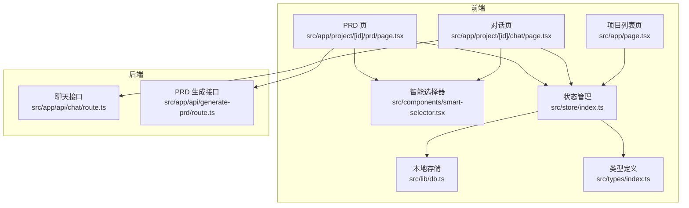
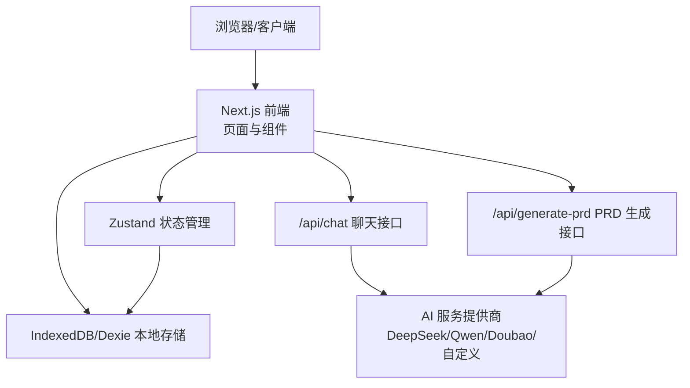
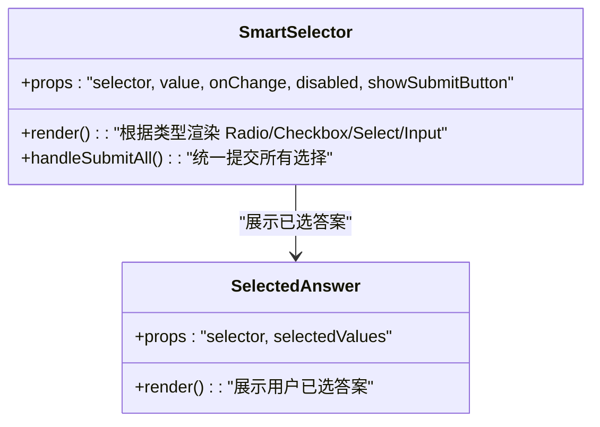
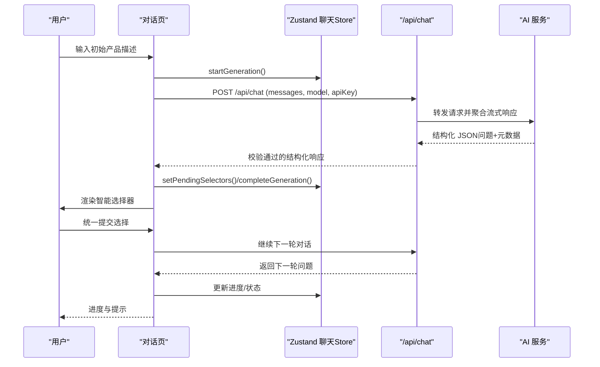
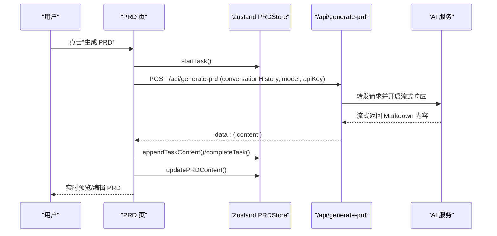
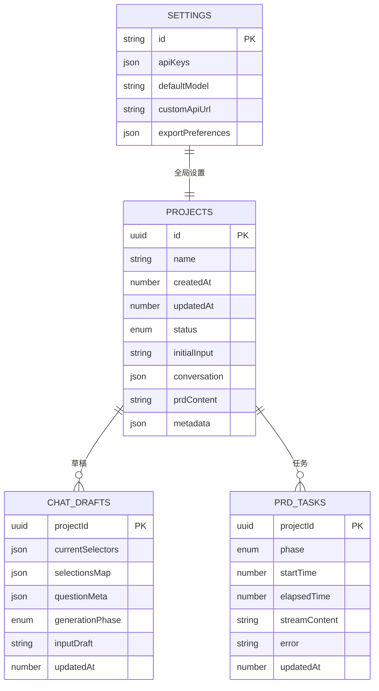
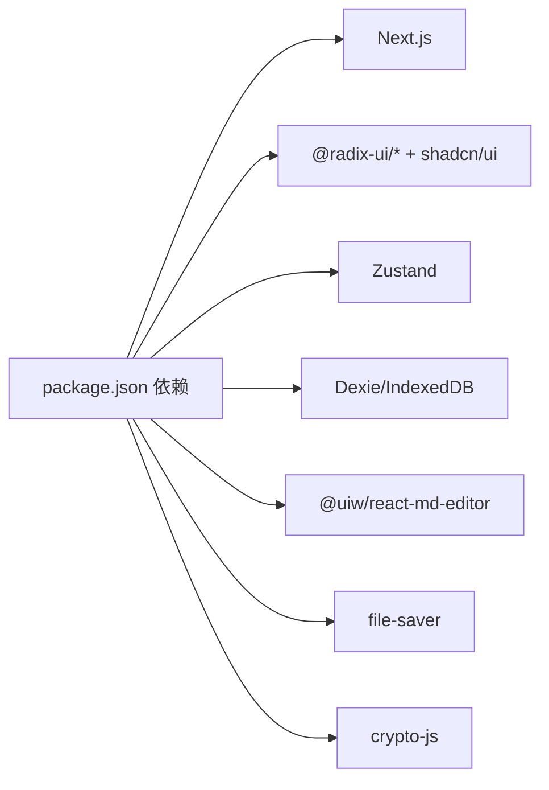

# 系统概述

<cite>
**本文引用的文件**
- [PRD.md](file://PRD.md)
- [package.json](file://prd-generator/package.json)
- [README.md](file://prd-generator/README.md)
- [src/app/page.tsx](file://prd-generator/src/app/page.tsx)
- [src/app/project/[id]/chat/page.tsx](file://prd-generator/src/app/project/[id]/chat/page.tsx)
- [src/app/project/[id]/prd/page.tsx](file://prd-generator/src/app/project/[id]/prd/page.tsx)
- [src/app/api/chat/route.ts](file://prd-generator/src/app/api/chat/route.ts)
- [src/app/api/generate-prd/route.ts](file://prd-generator/src/app/api/generate-prd/route.ts)
- [src/components/smart-selector.tsx](file://prd-generator/src/components/smart-selector.tsx)
- [src/store/index.ts](file://prd-generator/src/store/index.ts)
- [src/lib/db.ts](file://prd-generator/src/lib/db.ts)
- [src/types/index.ts](file://prd-generator/src/types/index.ts)
</cite>

## 目录
1. [引言](#引言)
2. [项目结构](#项目结构)
3. [核心组件](#核心组件)
4. [架构总览](#架构总览)
5. [详细组件分析](#详细组件分析)
6. [依赖关系分析](#依赖关系分析)
7. [性能考量](#性能考量)
8. [故障排查指南](#故障排查指南)
9. [结论](#结论)
10. [附录](#附录)

## 引言
PRDbot 是一款 AI 驱动的 PRD 文档生成工具，其核心定位是通过“引导式多轮对话”，将用户模糊的产品构想逐步转化为结构化、完整且面向 AI 工程师的 PRD 文档。系统强调“降低门槛、提升效率、面向 AI 工程师、智能优化”，目标用户包括缺乏产品经验的开发者、创业者、产品新手以及希望借助 AI 完善产品思路的任何用户。系统通过智能选择器、动态问答与实时文档生成等机制，帮助用户以最小输入成本获得高质量 PRD。

## 项目结构
PRDbot 采用前后端分离的 Next.js 应用结构，前端负责 UI、状态管理与本地存储，后端提供 AI 代理与文档导出服务。核心目录与文件如下：
- 前端入口与页面：项目列表页、对话页、PRD 生成页
- 组件层：智能选择器、项目卡片、状态栏等
- 状态与数据：Zustand 状态管理、IndexedDB/Dexie 本地持久化
- 类型定义：统一的数据结构与状态枚举
- API 层：聊天接口与 PRD 生成接口

图表来源
- [src/app/page.tsx](file://prd-generator/src/app/page.tsx#L1-L110)
- [src/app/project/[id]/chat/page.tsx](file://prd-generator/src/app/project/[id]/chat/page.tsx#L1-L120)
- [src/app/project/[id]/prd/page.tsx](file://prd-generator/src/app/project/[id]/prd/page.tsx#L1-L120)
- [src/components/smart-selector.tsx](file://prd-generator/src/components/smart-selector.tsx#L1-L80)
- [src/store/index.ts](file://prd-generator/src/store/index.ts#L1-L120)
- [src/lib/db.ts](file://prd-generator/src/lib/db.ts#L1-L60)
- [src/types/index.ts](file://prd-generator/src/types/index.ts#L1-L60)
- [src/app/api/chat/route.ts](file://prd-generator/src/app/api/chat/route.ts#L1-L60)
- [src/app/api/generate-prd/route.ts](file://prd-generator/src/app/api/generate-prd/route.ts#L1-L60)

章节来源
- [package.json](file://prd-generator/package.json#L1-L58)
- [README.md](file://prd-generator/README.md#L1-L37)

## 核心组件
- 项目列表页：展示项目卡片、搜索与新建项目入口，支持状态与进度可视化。
- 对话页：多轮引导式问答，AI 通过智能选择器生成问题，用户以单选/多选/下拉/开放输入等方式回答；支持草稿保存与重试。
- PRD 页：左右分栏，左侧继续对话，右侧实时预览/编辑 PRD；支持一键生成 PRD、导出 Markdown。
- 智能选择器：根据问题类型自动渲染合适的 UI 组件，支持“由 AI 决定”选项。
- 状态管理：Zustand 管理项目、设置、聊天与 PRD 生成任务状态，按项目 ID 隔离。
- 本地存储：Dexie + IndexedDB 存储项目、设置、聊天草稿与 PRD 任务，支持加密 API Key。
- 类型系统：统一定义项目、消息、选择器、AI 模型、生成阶段等类型。

章节来源
- [src/app/page.tsx](file://prd-generator/src/app/page.tsx#L1-L110)
- [src/app/project/[id]/chat/page.tsx](file://prd-generator/src/app/project/[id]/chat/page.tsx#L1-L120)
- [src/app/project/[id]/prd/page.tsx](file://prd-generator/src/app/project/[id]/prd/page.tsx#L1-L120)
- [src/components/smart-selector.tsx](file://prd-generator/src/components/smart-selector.tsx#L1-L120)
- [src/store/index.ts](file://prd-generator/src/store/index.ts#L1-L120)
- [src/lib/db.ts](file://prd-generator/src/lib/db.ts#L1-L120)
- [src/types/index.ts](file://prd-generator/src/types/index.ts#L1-L120)

## 架构总览
系统采用“前端 UI + Zustand 状态 + IndexedDB 本地存储 + 后端 AI 代理”的分层架构。前端通过 Next.js App Router 组织页面，聊天与 PRD 生成通过 API 路由对接多家 AI 服务（DeepSeek、Qwen、Doubao、自定义），并进行统一的安全校验与流式响应。

图表来源
- [src/app/api/chat/route.ts](file://prd-generator/src/app/api/chat/route.ts#L1-L120)
- [src/app/api/generate-prd/route.ts](file://prd-generator/src/app/api/generate-prd/route.ts#L1-L120)
- [src/store/index.ts](file://prd-generator/src/store/index.ts#L1-L120)
- [src/lib/db.ts](file://prd-generator/src/lib/db.ts#L1-L120)

## 详细组件分析

### 智能选择器组件（SmartSelector）
该组件根据问题类型动态渲染 UI，支持单选、多选、下拉与开放输入，并提供“由 AI 决定”选项。组件支持受控与非受控两种模式，统一提交所有选择，保证交互一致性与低输入成本。

图表来源
- [src/components/smart-selector.tsx](file://prd-generator/src/components/smart-selector.tsx#L1-L255)

章节来源
- [src/components/smart-selector.tsx](file://prd-generator/src/components/smart-selector.tsx#L1-L255)

### 对话流程（多轮引导式问答）
对话页通过后端聊天接口与 AI 交互，AI 以结构化 JSON 的形式返回问题与元数据，前端解析后渲染智能选择器，用户统一提交后继续下一轮，直到达到生成条件或用户主动结束。

图表来源
- [src/app/project/[id]/chat/page.tsx](file://prd-generator/src/app/project/[id]/chat/page.tsx#L200-L420)
- [src/app/api/chat/route.ts](file://prd-generator/src/app/api/chat/route.ts#L200-L426)
- [src/store/index.ts](file://prd-generator/src/store/index.ts#L295-L530)

章节来源
- [src/app/project/[id]/chat/page.tsx](file://prd-generator/src/app/project/[id]/chat/page.tsx#L1-L762)
- [src/app/api/chat/route.ts](file://prd-generator/src/app/api/chat/route.ts#L1-L426)
- [src/store/index.ts](file://prd-generator/src/store/index.ts#L1-L530)

### PRD 生成与编辑（左右分栏）
PRD 页在用户达到生成条件或主动点击“生成 PRD”后，调用后端 PRD 生成接口，AI 以流式方式返回 Markdown 内容，前端实时预览并在完成后持久化到本地存储。用户可在右侧编辑 PRD，编辑内容作为上下文参与后续对话。

图表来源
- [src/app/project/[id]/prd/page.tsx](file://prd-generator/src/app/project/[id]/prd/page.tsx#L180-L312)
- [src/app/api/generate-prd/route.ts](file://prd-generator/src/app/api/generate-prd/route.ts#L90-L254)
- [src/store/index.ts](file://prd-generator/src/store/index.ts#L532-L853)

章节来源
- [src/app/project/[id]/prd/page.tsx](file://prd-generator/src/app/project/[id]/prd/page.tsx#L1-L792)
- [src/app/api/generate-prd/route.ts](file://prd-generator/src/app/api/generate-prd/route.ts#L1-L254)
- [src/store/index.ts](file://prd-generator/src/store/index.ts#L532-L853)

### 数据模型与本地持久化
系统使用 Dexie 管理 IndexedDB，包含项目、设置、聊天草稿与 PRD 任务四张表。设置中的 API Key 采用加密存储，聊天草稿与 PRD 任务支持恢复与清理策略，保障用户在断网或刷新后仍可继续工作。

图表来源
- [src/lib/db.ts](file://prd-generator/src/lib/db.ts#L1-L210)
- [src/types/index.ts](file://prd-generator/src/types/index.ts#L45-L120)

章节来源
- [src/lib/db.ts](file://prd-generator/src/lib/db.ts#L1-L210)
- [src/types/index.ts](file://prd-generator/src/types/index.ts#L1-L243)

## 依赖关系分析
- 前端依赖：Next.js、Radix UI、Tailwind、Zustand、Dexie、react-markdown、@uiw/react-md-editor、file-saver 等。
- 后端依赖：Node.js、fetch（SSE）、AI 服务提供商 API。
- 类型与状态：统一类型定义与状态枚举，确保前后端契约一致。
- 安全与合规：聊天接口对自定义 API URL 进行域名白名单与内网限制，防止 SSRF；设置中的 API Key 加密存储。

图表来源
- [package.json](file://prd-generator/package.json#L1-L58)

章节来源
- [package.json](file://prd-generator/package.json#L1-L58)

## 性能考量
- 流式响应：聊天与 PRD 生成均采用 SSE 流式传输，前端按 chunk 追加，避免一次性渲染大文本导致卡顿。
- 本地持久化：IndexedDB 与 Dexie 提升数据读写性能，配合草稿与任务恢复减少重复生成。
- 状态隔离：按项目 ID 隔离聊天与 PRD 任务状态，避免全局状态膨胀。
- UI 优化：骨架屏与懒加载编辑器，移动端分栏布局，提升交互流畅度。

## 故障排查指南
- API Key 未配置：前端在聊天与 PRD 生成前会检查设置，若未配置会提示错误。请前往设置页面配置对应模型的 API Key。
- 自定义 API URL 校验失败：后端对自定义域名进行白名单与内网限制，若返回“不在允许的 API 域名白名单中”或“不允许访问内网地址”，请检查域名与协议。
- 生成失败或格式异常：聊天接口具备后端校验与自动重试机制，若多次重试仍失败，前端会显示错误并保留原始内容以便人工修正。
- 任务中断恢复：PRD 任务支持中断恢复与清理策略，若检测到中断任务，前端会提示重试；若项目已有有效内容，将清除错误状态。
- 本地存储异常：如出现数据不同步，可清理过期草稿与已完成任务，或重新加载页面。

章节来源
- [src/app/api/chat/route.ts](file://prd-generator/src/app/api/chat/route.ts#L1-L120)
- [src/app/project/[id]/chat/page.tsx](file://prd-generator/src/app/project/[id]/chat/page.tsx#L300-L420)
- [src/app/project/[id]/prd/page.tsx](file://prd-generator/src/app/project/[id]/prd/page.tsx#L100-L180)
- [src/lib/db.ts](file://prd-generator/src/lib/db.ts#L120-L210)

## 结论
PRDbot 通过“引导式多轮对话 + 智能选择器 + 实时文档生成”的闭环，将复杂的产品需求梳理过程简化为低输入成本的交互体验。系统以“降低门槛、提升效率、面向 AI 工程师、智能优化”为核心价值，覆盖从需求探索到 PRD 生成与编辑的全流程，适合开发者、创业者与产品新手快速产出高质量 PRD。

## 附录
- 产品定位、核心价值与目标用户详见 PRD 文档。
- 技术栈与系统架构详见 PRD 文档“技术架构”与“数据模型”。

章节来源
- [PRD.md](file://PRD.md#L1-L200)
- [PRD.md](file://PRD.md#L335-L434)