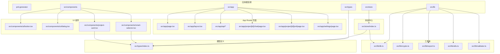
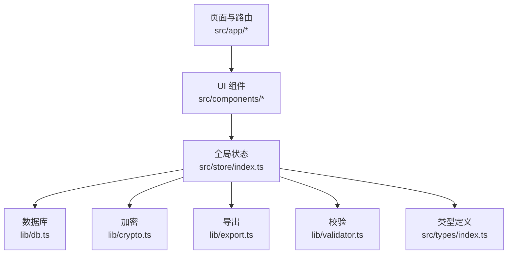
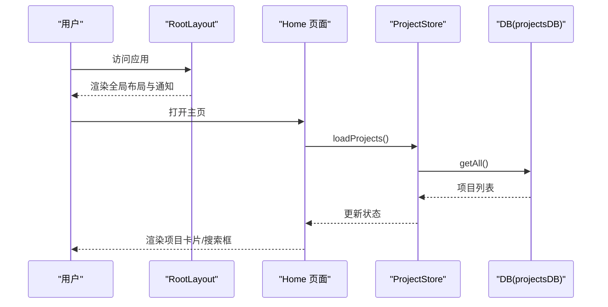
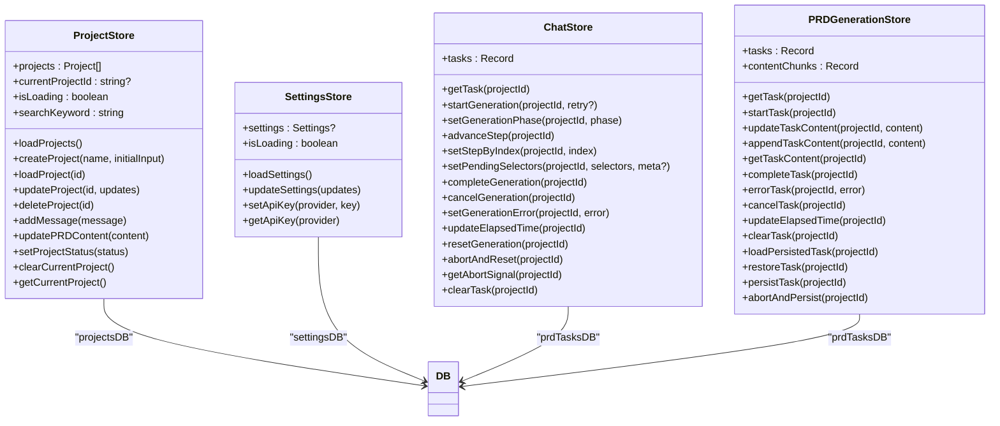
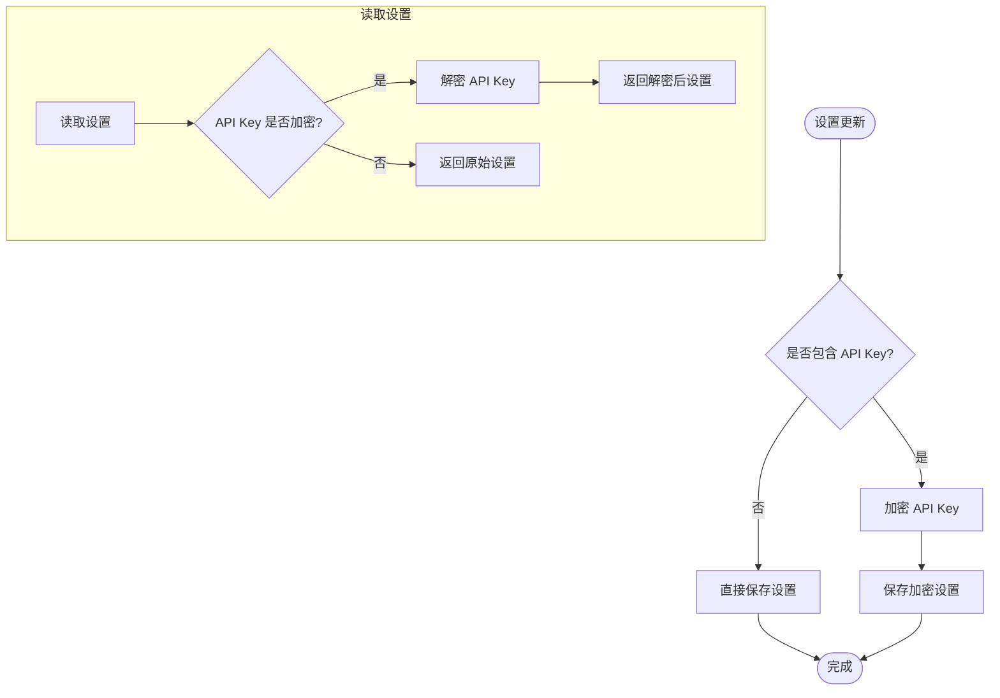
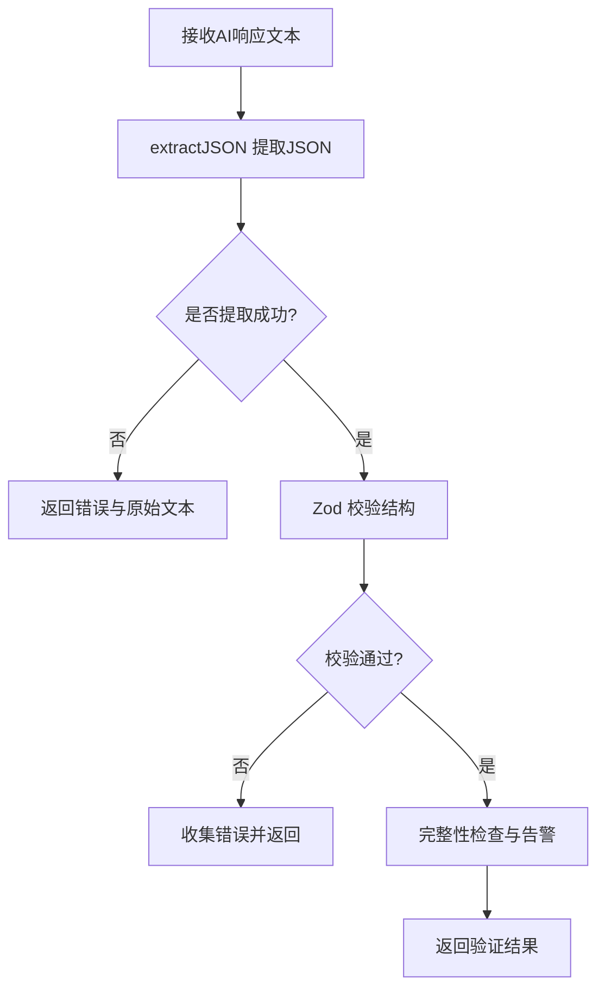
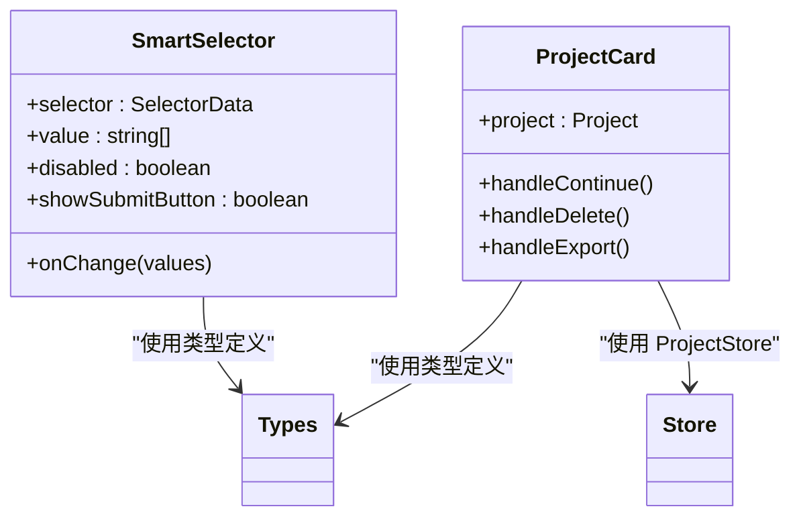
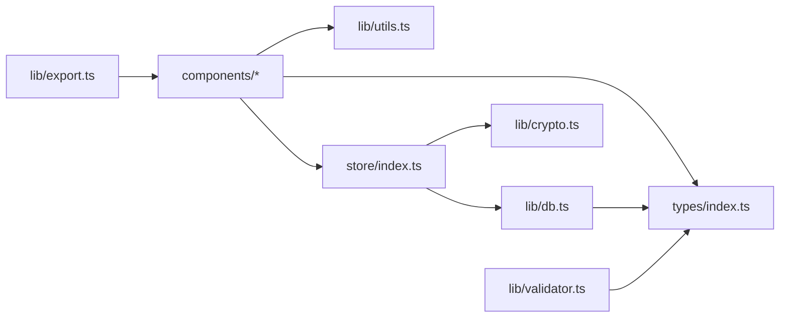

# 项目结构详解

<cite>
**本文引用的文件**
- [package.json](file://prd-generator/package.json)
- [layout.tsx](file://prd-generator/src/app/layout.tsx)
- [page.tsx](file://prd-generator/src/app/page.tsx)
- [index.ts](file://prd-generator/src/store/index.ts)
- [index.ts](file://prd-generator/src/types/index.ts)
- [db.ts](file://prd-generator/src/lib/db.ts)
- [crypto.ts](file://prd-generator/src/lib/crypto.ts)
- [export.ts](file://prd-generator/src/lib/export.ts)
- [utils.ts](file://prd-generator/src/lib/utils.ts)
- [validator.ts](file://prd-generator/src/lib/validator.ts)
- [button.tsx](file://prd-generator/src/components/ui/button.tsx)
- [dialog.tsx](file://prd-generator/src/components/ui/dialog.tsx)
- [smart-selector.tsx](file://prd-generator/src/components/smart-selector.tsx)
- [project-card.tsx](file://prd-generator/src/components/project-card.tsx)
- [README.md](file://prd-generator/README.md)
</cite>

## 目录
1. [引言](#引言)
2. [项目结构](#项目结构)
3. [核心组件](#核心组件)
4. [架构总览](#架构总览)
5. [详细组件分析](#详细组件分析)
6. [依赖关系分析](#依赖关系分析)
7. [性能考量](#性能考量)
8. [故障排查指南](#故障排查指南)
9. [结论](#结论)
10. [附录](#附录)

## 引言
本文件面向开发者，系统性解析 PRD 生成工具的代码库结构与职责划分，帮助快速定位代码、理解模块组织方式，并建立对空间布局的整体认知。重点覆盖：
- Next.js 应用路由与页面根目录 prd-generator/src/app 的职责
- UI 组件层（components/ui 封装与自定义组件 SmartSelector）
- 核心工具库（lib 下 db.ts、crypto.ts、export.ts 等）
- 全局状态中心 store/index.ts 的作用
- 类型定义统一入口 types/index.ts 的重要性

## 项目结构
该仓库采用“特性分层 + Next.js App Router”的组织方式：
- 顶层 prd-generator 为 Next.js 应用根目录
- src/app 为 Next.js App Router 的页面与路由根目录，包含页面、布局、API 路由等
- src/components 为 UI 组件层，包含 shadcn/ui 的封装与业务自定义组件
- src/lib 为核心工具库，提供数据库、加密、导出、校验等能力
- src/store 为全局状态中心，基于 Zustand 管理项目、设置、生成任务等状态
- src/types 为统一类型定义入口，贯穿全栈逻辑

图表来源
- [layout.tsx](file://prd-generator/src/app/layout.tsx#L1-L37)
- [page.tsx](file://prd-generator/src/app/page.tsx#L1-L110)
- [index.ts](file://prd-generator/src/store/index.ts#L1-L208)
- [db.ts](file://prd-generator/src/lib/db.ts#L1-L210)
- [crypto.ts](file://prd-generator/src/lib/crypto.ts#L1-L107)
- [export.ts](file://prd-generator/src/lib/export.ts#L1-L18)
- [utils.ts](file://prd-generator/src/lib/utils.ts#L1-L7)
- [validator.ts](file://prd-generator/src/lib/validator.ts#L1-L274)
- [button.tsx](file://prd-generator/src/components/ui/button.tsx#L1-L61)
- [dialog.tsx](file://prd-generator/src/components/ui/dialog.tsx#L1-L144)
- [smart-selector.tsx](file://prd-generator/src/components/smart-selector.tsx#L1-L255)
- [project-card.tsx](file://prd-generator/src/components/project-card.tsx#L1-L128)
- [index.ts](file://prd-generator/src/types/index.ts#L1-L243)

章节来源
- [package.json](file://prd-generator/package.json#L1-L58)
- [README.md](file://prd-generator/README.md#L1-L37)

## 核心组件
- Next.js 应用根目录与页面
  - src/app/layout.tsx 提供全局布局、主题与通知组件注入
  - src/app/page.tsx 为主页，负责项目列表展示、搜索与新建项目
- UI 组件层
  - components/ui 封装了 shadcn/ui 的基础组件（如 Button、Dialog），统一样式与变体
  - components/smart-selector.tsx 为业务自定义组件，支持多种选择器类型与受控/非受控模式
  - components/project-card.tsx 展示项目卡片，承载导航、状态与操作
- 工具库
  - lib/db.ts 基于 Dexie 实现本地数据库，提供项目、设置、草稿、PRD任务的 CRUD 与版本迁移
  - lib/crypto.ts 提供 API Key 加密/解密与设备指纹派生密钥
  - lib/export.ts 提供 Markdown/JSON 导出能力
  - lib/utils.ts 提供 Tailwind 合并类名的通用工具
  - lib/validator.ts 提供 AI 响应 JSON 结构校验、SSE 流聚合等
- 全局状态中心
  - store/index.ts 基于 Zustand 管理项目、设置、聊天与 PRD 生成任务三类 Store，集中处理状态与持久化
- 类型定义
  - types/index.ts 统一定义项目、消息、选择器、生成阶段、PRD 任务等类型，保证跨模块一致性

章节来源
- [layout.tsx](file://prd-generator/src/app/layout.tsx#L1-L37)
- [page.tsx](file://prd-generator/src/app/page.tsx#L1-L110)
- [button.tsx](file://prd-generator/src/components/ui/button.tsx#L1-L61)
- [dialog.tsx](file://prd-generator/src/components/ui/dialog.tsx#L1-L144)
- [smart-selector.tsx](file://prd-generator/src/components/smart-selector.tsx#L1-L255)
- [project-card.tsx](file://prd-generator/src/components/project-card.tsx#L1-L128)
- [db.ts](file://prd-generator/src/lib/db.ts#L1-L210)
- [crypto.ts](file://prd-generator/src/lib/crypto.ts#L1-L107)
- [export.ts](file://prd-generator/src/lib/export.ts#L1-L18)
- [utils.ts](file://prd-generator/src/lib/utils.ts#L1-L7)
- [validator.ts](file://prd-generator/src/lib/validator.ts#L1-L274)
- [index.ts](file://prd-generator/src/store/index.ts#L1-L853)
- [index.ts](file://prd-generator/src/types/index.ts#L1-L243)

## 架构总览
整体采用“页面层（Next.js App Router）—组件层（UI + 业务组件）—状态层（Zustand）—工具层（DB/Crypto/Export/Validator）—类型层（统一类型）”的分层架构，强调：
- 页面与路由集中在 src/app，便于按路径组织功能
- UI 组件通过 shadcn/ui 封装与自定义组件扩展，提升复用性
- 状态集中于 store/index.ts，避免跨组件重复状态管理
- 工具库提供可测试、可复用的能力，降低页面与组件耦合
- 类型定义集中于 types/index.ts，贯穿全栈逻辑，减少类型漂移

图表来源
- [layout.tsx](file://prd-generator/src/app/layout.tsx#L1-L37)
- [page.tsx](file://prd-generator/src/app/page.tsx#L1-L110)
- [index.ts](file://prd-generator/src/store/index.ts#L1-L853)
- [db.ts](file://prd-generator/src/lib/db.ts#L1-L210)
- [crypto.ts](file://prd-generator/src/lib/crypto.ts#L1-L107)
- [export.ts](file://prd-generator/src/lib/export.ts#L1-L18)
- [validator.ts](file://prd-generator/src/lib/validator.ts#L1-L274)
- [index.ts](file://prd-generator/src/types/index.ts#L1-L243)

## 详细组件分析

### 全局布局与主页
- 全局布局
  - layout.tsx 注入全局样式、字体与通知组件，提供应用级上下文
- 主页
  - page.tsx 负责加载项目列表、搜索过滤、空态与骨架屏渲染，并提供新建项目入口

图表来源
- [layout.tsx](file://prd-generator/src/app/layout.tsx#L1-L37)
- [page.tsx](file://prd-generator/src/app/page.tsx#L1-L110)
- [index.ts](file://prd-generator/src/store/index.ts#L1-L208)
- [db.ts](file://prd-generator/src/lib/db.ts#L1-L72)

章节来源
- [layout.tsx](file://prd-generator/src/app/layout.tsx#L1-L37)
- [page.tsx](file://prd-generator/src/app/page.tsx#L1-L110)

### 全局状态中心（Zustand）
- 项目 Store（ProjectStore）
  - 负责项目列表、当前项目、搜索关键字、加载状态
  - 提供创建、加载、更新、删除、清空当前项目等操作
  - 通过 projectsDB 与本地数据库交互，保持状态与持久化一致
- 设置 Store（SettingsStore）
  - 负责全局设置加载与更新，支持 API Key 的加密存储与读取
- 聊天生成任务 Store（ChatStore）
  - 按项目隔离生成任务状态，支持启动、推进步骤、挂起、取消、错误处理、超时统计等
- PRD 生成任务 Store（PRDGenerationStore）
  - 支持流式内容追加与合并、任务生命周期管理、持久化与恢复、中断安全保存

图表来源
- [index.ts](file://prd-generator/src/store/index.ts#L1-L853)
- [db.ts](file://prd-generator/src/lib/db.ts#L1-L210)

章节来源
- [index.ts](file://prd-generator/src/store/index.ts#L1-L853)

### 数据库与加密
- 数据库（lib/db.ts）
  - 基于 Dexie 定义数据库版本与表结构，提供项目、设置、聊天草稿、PRD任务的 CRUD
  - 支持版本迁移、索引字段、清理过期数据
- 加密（lib/crypto.ts）
  - 基于设备指纹派生密钥，对 API Key 进行 AES 加密/解密
  - 提供 isEncrypted 简单判断，保障敏感信息本地安全

图表来源
- [db.ts](file://prd-generator/src/lib/db.ts#L74-L137)
- [crypto.ts](file://prd-generator/src/lib/crypto.ts#L1-L107)

章节来源
- [db.ts](file://prd-generator/src/lib/db.ts#L1-L210)
- [crypto.ts](file://prd-generator/src/lib/crypto.ts#L1-L107)

### 导出与校验
- 导出（lib/export.ts）
  - 提供 Markdown 与 JSON 文件导出，基于 file-saver
- 校验（lib/validator.ts）
  - 使用 Zod 对 AI 响应进行结构校验，支持从文本中提取 JSON、SSE 流聚合、完整性检查与重试提示词构建

图表来源
- [validator.ts](file://prd-generator/src/lib/validator.ts#L55-L147)

章节来源
- [export.ts](file://prd-generator/src/lib/export.ts#L1-L18)
- [validator.ts](file://prd-generator/src/lib/validator.ts#L1-L274)

### UI 组件与自定义组件
- shadcn/ui 封装（components/ui/*）
  - 通过 cva 与 class-variance-authority 统一样式与变体，结合 utils.ts 的类名合并工具
- SmartSelector（components/smart-selector.tsx）
  - 支持多种选择器类型（单选、多选、下拉、文本），提供受控/非受控两种模式，内置必填校验与提交按钮
- ProjectCard（components/project-card.tsx）
  - 展示项目名称、状态徽章、进度条、更新时间与操作菜单（继续/查看/导出/删除）

图表来源
- [smart-selector.tsx](file://prd-generator/src/components/smart-selector.tsx#L1-L255)
- [project-card.tsx](file://prd-generator/src/components/project-card.tsx#L1-L128)
- [index.ts](file://prd-generator/src/types/index.ts#L1-L243)
- [index.ts](file://prd-generator/src/store/index.ts#L1-L208)

章节来源
- [button.tsx](file://prd-generator/src/components/ui/button.tsx#L1-L61)
- [dialog.tsx](file://prd-generator/src/components/ui/dialog.tsx#L1-L144)
- [smart-selector.tsx](file://prd-generator/src/components/smart-selector.tsx#L1-L255)
- [project-card.tsx](file://prd-generator/src/components/project-card.tsx#L1-L128)

## 依赖关系分析
- 组件依赖
  - UI 组件依赖 utils.ts 的类名合并工具
  - SmartSelector 与 ProjectCard 依赖 types/index.ts 的类型定义
  - ProjectCard 依赖 store/index.ts 的项目状态与操作
- 状态依赖
  - store/index.ts 依赖 lib/db.ts 的数据库接口与 lib/crypto.ts 的加密工具
- 工具依赖
  - lib/db.ts 依赖 dexie 与 types/index.ts 的类型
  - lib/validator.ts 依赖 zod 与浏览器流 API
- 应用依赖
  - package.json 指定 Next.js、Radix UI、Tailwind、Zustand、date-fns、crypto-js、file-saver 等依赖

图表来源
- [package.json](file://prd-generator/package.json#L1-L58)
- [utils.ts](file://prd-generator/src/lib/utils.ts#L1-L7)
- [index.ts](file://prd-generator/src/store/index.ts#L1-L853)
- [db.ts](file://prd-generator/src/lib/db.ts#L1-L210)
- [crypto.ts](file://prd-generator/src/lib/crypto.ts#L1-L107)
- [validator.ts](file://prd-generator/src/lib/validator.ts#L1-L274)
- [export.ts](file://prd-generator/src/lib/export.ts#L1-L18)
- [index.ts](file://prd-generator/src/types/index.ts#L1-L243)

章节来源
- [package.json](file://prd-generator/package.json#L1-L58)

## 性能考量
- 状态更新策略
  - store/index.ts 中对聊天与 PRD 生成任务采用按项目隔离的状态映射，避免全局重渲染
  - PRDGenerationStore 使用 contentChunks 数组缓存流式片段，减少字符串拼接开销
- 数据访问
  - db.ts 对项目列表按 updatedAt 倒序查询，提高最近项目优先展示体验
- UI 优化
  - page.tsx 使用骨架屏与空态，改善首次加载与无数据场景的用户体验
  - SmartSelector 支持受控模式，便于批量提交与减少中间态渲染

章节来源
- [index.ts](file://prd-generator/src/store/index.ts#L532-L853)
- [db.ts](file://prd-generator/src/lib/db.ts#L1-L72)
- [page.tsx](file://prd-generator/src/app/page.tsx#L1-L110)

## 故障排查指南
- 设置加载失败或 API Key 无法读取
  - 检查 settingsDB.get()/getOrCreate() 是否正确调用，确认数据库是否存在
  - 若存在加密字段，确认 isEncrypted 判断与 decryptApiKeys 流程
- 生成任务中断或状态异常
  - 检查 prdTasksDB 的持久化与恢复逻辑，确认 phase 与 error 字段
  - 使用 abortAndPersist 在组件卸载时安全中断并保存
- SSE 流解析异常
  - 使用 validator.ts 的 aggregateSSEStream 逐行解析 data: 行，注意 [DONE] 标记与 UTF-8 解码
- 选择器校验失败
  - 使用 validator.ts 的 validateAIResponse 与 extractJSON，关注错误集合与重试提示词

章节来源
- [db.ts](file://prd-generator/src/lib/db.ts#L74-L137)
- [crypto.ts](file://prd-generator/src/lib/crypto.ts#L1-L107)
- [index.ts](file://prd-generator/src/store/index.ts#L532-L853)
- [validator.ts](file://prd-generator/src/lib/validator.ts#L218-L274)

## 结论
本项目通过清晰的分层与职责划分，实现了“页面—组件—状态—工具—类型”的高内聚低耦合架构。开发者可依据本文档快速定位到：
- 页面与路由：src/app/*
- UI 组件：src/components/*
- 状态中心：src/store/index.ts
- 工具库：src/lib/*
- 类型定义：src/types/index.ts

在此基础上，可进一步扩展新页面、新增组件与状态模块，同时保持类型与工具层的稳定与可维护性。

## 附录
- 快速启动与开发
  - 使用 package.json 中的脚本启动开发服务器
  - 默认访问 http://localhost:3000 查看首页效果

章节来源
- [README.md](file://prd-generator/README.md#L1-L37)
- [package.json](file://prd-generator/package.json#L1-L58)